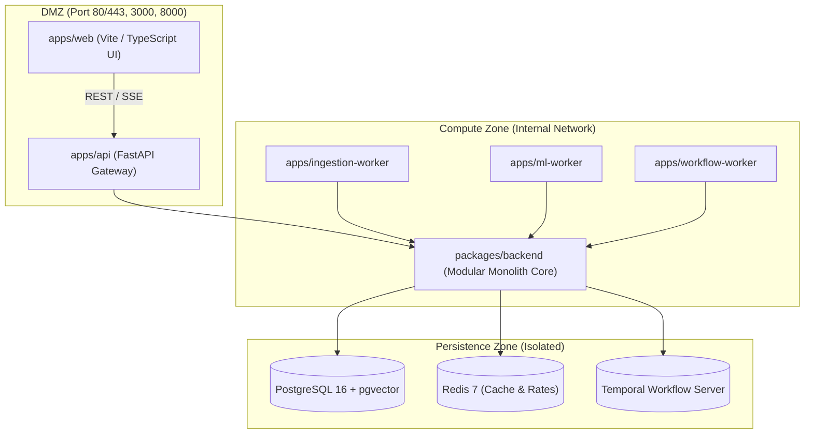

# RevPilot AI

[](https://github.com/DuongVinh2004/RevPilot-AI/actions/workflows/ci.yml)
[](https://github.com/DuongVinh2004/RevPilot-AI/actions/workflows/codeql.yml)
[](LICENSE)
[](pyproject.toml)
[](package.json)
[](CONTRIBUTING.md)

**RevPilot AI** is an enterprise-grade Autonomous Revenue Intelligence & Action Platform for Revenue Operations (RevOps). It unites anomaly localization, causal AI inference, multi-agent ticket investigation, and human-in-the-loop action execution into a mathematically bounded, fail-closed platform.

---

## Core Product Lifecycle

```
DETECT ──> INVESTIGATE ──> REASON ──> VERIFY ──> DECIDE ──> APPROVE ──> ACT ──> MEASURE ──> LEARN
```

1. **DETECT**: Anomaly localization and time-series metric deviation tracking (`analytics`).
2. **INVESTIGATE**: Autonomous ticket and multi-modal investigation with evidence provenance graphs (`investigation`).
3. **REASON**: Causal discovery and counterfactual uplift modeling (`causal`).
4. **VERIFY**: Anti-hallucination verification grounder preventing unsupported claims (`verifier`).
5. **DECIDE**: Constraint satisfaction and budget-bounded policy selection (`decision`).
6. **APPROVE**: Cryptographically signed human approval gate for tier-1..3 mutations (`approval`).
7. **ACT**: Idempotent tool execution with rate limiters and blast-radius bounding (`action`).
8. **MEASURE & LEARN**: Observability feedback, continuous calibration, and audit logging (`finops`).

---

## Architectural Invariants (Non-Negotiable)

- **Zero Agent Self-Approval (INV-ACT-003)**: No AI agent, LLM, or service account may approve its own actions. Tier-1..3 mutations require an authenticated human approval token (HMAC-SHA256).
- **Fail-Closed Execution (INV-SEC-001)**: Missing tokens, unverified claims, network partitions, or ambiguous tenant headers immediately fail closed.
- **Strict Multi-Tenant Isolation (INV-TEN-001)**: Tenant context is server-derived from cryptographic credentials. Zero cross-tenant data leaks in databases, Redis caches, or vector indexes.
- **Anti-Fabrication Invariant (AC-014)**: Benchmark scores, uplift estimates, and test results must originate from verifiable machine logs. Hallucinated or mocked scores are strictly forbidden.
- **Audit Immutability (INV-AUD-001)**: Every state mutation, decision rationale, and tool execution is recorded in an append-only cryptographic audit log.

---

## System Architecture



---

## Repository Structure

```
.
├── apps/
│   ├── api/                 # FastAPI REST & SCIM Gateway, Auth & Audit Middleware
│   ├── web/                 # TypeScript/Vite UI (Anomaly Dashboard, Approval Center)
│   ├── ingestion-worker/    # High-throughput data connector worker
│   ├── ml-worker/           # Causal inference and model evaluation worker
│   └── workflow-worker/     # Temporal durable execution worker
├── packages/
│   └── backend/             # Core modular monolith domain services & adapters
│       ├── alembic/         # 13 migration versions covering full enterprise schema
│       └── src/revpilot/
│           ├── infrastructure/  # Database session, pooling, pgvector setup
│           └── modules/         # Anomaly, Causal, Decision, Approval, Verifier, Safety
├── docs/                    # Complete architectural specifications (ADRs, NFRs)
├── execution/               # Execution queues, roadmap, and rail control
├── infra/                   # Infrastructure configuration, Docker, network topologies
├── tasks/                   # Micro-task specs and acceptance criteria
└── tests/                   # 550+ automated unit and integration tests
```

---

## Quick Start (Local Development)

### Prerequisites
- [Docker](https://docs.docker.com/get-docker/) & Docker Compose v2+
- Python 3.12+
- Node.js 20+

### 1. Launch Platform with Docker Compose

Start the full platform with a 3-zone defense-in-depth network topology:

```bash
docker compose up -d
```

- **Web Dashboard**: [http://localhost:3000](http://localhost:3000)
- **API Swagger Docs**: [http://localhost:8000/docs](http://localhost:8000/docs)
- **Temporal UI**: [http://localhost:8088](http://localhost:8088)

### 2. Run Tests Locally

RevPilot AI includes over 550 automated unit, integration, and security tests:

```bash
# Set up virtual environment
python -m venv .venv
source .venv/bin/activate  # Or .venv\Scripts\activate on Windows

# Install dependencies
pip install -e ".[dev]"

# Run full test suite
python -m pytest tests/ -v
```

### 3. Code Formatting & Type Safety

```bash
# Lint code
ruff check .

# Type checking
mypy packages/backend/src
```

---

## Documentation

Full architectural specifications and decision records are maintained in `docs/`:

- [SPECIFICATION-PRECEDENCE.md](docs/00-executive/SPECIFICATION-PRECEDENCE.md) — Precedence hierarchy and closure rules
- [INVARIANT-REGISTRY.md](docs/03-requirements/INVARIANT-REGISTRY.md) — Canonical platform invariants
- [SECURITY-ARCHITECTURE.md](docs/15-security/SECURITY-ARCHITECTURE.md) — Defense-in-depth security model
- [Architecture Decision Records](docs/31-adr/) — ADR-0001 through ADR-0012
- [Database Schema Specification](docs/27-database/DATABASE-SCHEMA.md) — Multi-tenant schema design

---

## Contributing & Code of Conduct

We welcome community contributions that conform to our safety invariants and testing rigor.
- Please read our [Contributing Guide](CONTRIBUTING.md) for details on code standards and the PR process.
- All contributors must abide by our [Code of Conduct](CODE_OF_CONDUCT.md).

---

## Security

To report security issues, please refer to our [Security Policy](SECURITY.md). Do not file public GitHub issues for security vulnerabilities.

---

## License

RevPilot AI is open-source software licensed under the [Apache License, Version 2.0](LICENSE).
