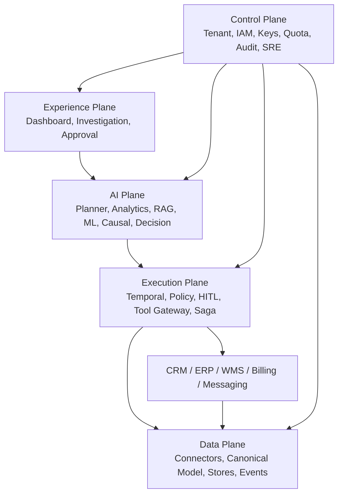

# Executive Vision

Status: Accepted Canonical Specification  
Owner: Product + Principal Architecture  
Approver: Dương Vinh  
Version: v1.0  
Date: 2026-09-04  
Scope: Product intent and executive architecture

## Revision History

| Version | Date | Author | Reviewer | Approval | Summary of Changes |
|---|---|---|---|---|---|
| v0.1 | 2026-09-04 | Product & Architecture | Principal Architect | Dương Vinh | Initial executive vision and product thesis |

## Product thesis

RevPilot AI helps a revenue organization detect revenue risk early, investigate it across fragmented operational systems, recommend economically justified interventions, and execute approved actions with measurable outcomes. It is a decision-and-action system, not a conversational answer engine.

The flagship scenario is a sudden increase in order cancellations caused by regional carrier capacity constraints (canonical benchmark scenario `INC-SYNTH-TRUCK-001` centered at warehouse `WH-MIDWEST-01` in Chicago, IL). The platform establishes whether the increase is statistically abnormal, identifies which warehouse/carrier/segment contributes to it, correlates complaints and fulfillment signals, retrieves applicable SLA evidence, tests alternative causal hypotheses, estimates revenue at risk, recommends an intervention, obtains the required approval, executes via controlled tools, and measures outcomes at 7/30/90 days.

## Intended customers and users

| Actor | Primary job | Authority boundary |
|---|---|---|
| Revenue executive | Understand revenue risk and approve high-value intervention | Tenant and business-unit scope |
| RevOps analyst | Investigate anomalies and inspect evidence | Read governed business data; propose actions |
| Sales/CS manager | Review customers and approve bounded actions | Region/portfolio and monetary threshold |
| Data/AI team | Operate data, models, evaluations | No automatic business-action authority |
| Security/admin | Configure identity, policy, audit, kill switches | Privileged, separated duties |
| RevPilot agent | Execute delegated investigation steps | Ephemeral, scoped capability; never tenant admin |

## Business outcomes

- `BR-001`: Reduce time from anomaly emergence to a verified root-cause hypothesis.
- `BR-002`: Reduce preventable churn and revenue leakage without excessive intervention cost.
- `BR-003`: Make every recommendation and action evidence-linked, policy-governed, and auditable.
- `BR-004`: Operate safely across tenants and business units.
- `BR-005`: Learn from measured outcomes while preventing uncontrolled autonomous behavior.

## Executive architecture

The Control Plane defines authority and budgets. The Data Plane owns ingestion and governed data products. The AI Plane produces hypotheses and recommendations but does not own credentials. The Execution Plane is the only path to side effects. The Experience Plane presents user-appropriate explanations and approval controls.

## Release boundaries

| Release | Outcome | Explicitly excluded |
|---|---|---|
| MVP | One reproducible synthetic RevOps scenario from detection through approved dry-run | Real customer writes, SAML/SCIM, billing, multi-region |
| Production v1 | Multi-tenant commercial pilot with real connectors, governed actions, SLOs, audit, usage metering | Active-active multi-region unless justified |
| Future v2 | Advanced uplift/causal learning, model routing, dedicated regulated tiers, broader RevOps domains | Unbounded autonomy |

## Success measures

Targets are set in the evaluation specification and measured later. Mandatory categories are root-cause ranking, evidence/citation quality, SQL correctness, calibration, uplift quality, causal-effect error, task success, policy compliance, duplicate-action rate, recovery success, latency, cost per investigation, retained revenue, and cross-tenant leakage. `Cross-tenant leakage = 0` and `unauthorized action rate = 0` are invariants, not optimization targets.

## Economic model

For an eligible action `a`, RevPilot optimizes expected utility:

`EU(a) = expected retained revenue - intervention cost - risk cost - customer-experience cost - policy penalty`

Hard constraints override utility. An action forbidden by policy, outside delegated authority, over budget, or beyond blast-radius limits is ineligible regardless of predicted benefit.

## Principal risks

The main risks are false causal claims, biased targeting, stale or unauthorized evidence, cross-tenant leakage, prompt/tool injection, duplicated irreversible actions, connector drift, approval bypass, model regression, hidden cost loops, and operational complexity exceeding team capacity. The roadmap addresses safety and observability before real write integrations.

