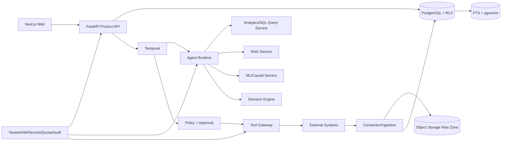

# Canonical System Architecture

Status: Proposed v0.2

Canonical foundation references: [system/trust boundaries](SYSTEM-BOUNDARIES.md), [future repository topology](REPOSITORY-TOPOLOGY.md), [module ownership](MODULE-BOUNDARIES.md), [dependency rules](DEPENDENCY-RULES.md), [workload assumptions](../03-requirements/WORKLOAD-ASSUMPTIONS.md), and [ADR set](../31-adr/ADR-0001-application-architecture.md). All ADRs remain Proposed until explicitly approved.

## Architectural style

Start as a modular monolith for domain/API/control logic plus independently deployed workers where workload or security boundaries justify separation. Temporal is the durable outer workflow. The agent runtime is a versioned reasoning subgraph invoked by Temporal activities; it does not own long-lived business state. Side effects are isolated behind the Tool Gateway. Data/ML pipelines are separate deployables because they scale and fail differently from transactional APIs.

This avoids a distributed monolith while preserving future service seams. A module becomes a service only for independent scaling, stronger security/failure isolation, materially different runtime, or independent deployment ownership. Network boundaries do not substitute for module boundaries.

## Plane boundaries

| Plane | Owns | Must not do directly |
|---|---|---|
| Experience | Sessions, views, user intent, approval UX | Query raw tenant stores or execute actions |
| AI | Plans, typed agent results, ML/RAG inference, hypotheses, recommendations | Hold secrets, bypass policy, perform writes |
| Execution | Temporal histories, policy decision, approval binding, action ledger, tool invocation | Invent business evidence |
| Data | Ingestion, canonical records, lineage, quality, indexes, feature inputs | Grant user/agent authority |
| Control | Tenant/IAM/key/quota/audit/release/SRE control | Become a hidden backdoor to business action |

## Logical components

## Canonical technology decisions

These are proposed and require ADR acceptance before implementation.

| Decision | Now | Revisit trigger |
|---|---|---|
| Backend | Python 3.12 + FastAPI composition over typed modular monolith — ADR-0001 | ADR-0001 measurable extraction triggers |
| Web | Next.js + TypeScript | Native/embedded client requirement |
| Transactional store | PostgreSQL authoritative store — ADR-0004; shared-tier RLS — ADR-0005 | ADR-0004/0005 workload, isolation, restore and noisy-neighbor triggers |
| Retrieval MVP | PostgreSQL FTS + pgvector behind `RetrievalPort` — ADR-0006 | ADR-0006 corpus/p95/OLTP/features/isolation triggers |
| Workflow | Temporal outer Business Workflow — ADR-0002 | ADR-0002 durability/operations incompatibility evidence |
| Agent runtime | LangGraph behind RevPilot `AgentRuntime` port — ADR-0003 | ADR-0003 schema/replay/overhead/release failures |
| Events | Transactional outbox + dispatcher/inbox first — ADR-0007 | ADR-0007 sustained lag/throughput/replay/fan-out triggers for Kafka |
| Cache | Redis only for disposable cache/rate limits, never source of truth | No cache benefit in profiling |
| ML tracking | MLflow | Governance integration proves insufficient |
| Secrets | Local injected uncommitted source; managed store/workload identity commercially — ADR-0009 | ADR-0009 multi-cloud/dynamic credential/CMEK triggers |
| Observability | OpenTelemetry with vendor-neutral Collector — ADR-0010 | Backend/cost/retention/residency triggers |
| AI provider | RevPilot Model Gateway port + deterministic fake; production provider UNKNOWN — ADR-0011 | Provider adapter review and multi-provider/local-serving triggers |
| Deployment | OCI containers/local composition; managed container baseline; Kubernetes deferred — ADR-0008 | ADR-0008 measurable scheduling/scale/security/ownership triggers |

## Request and investigation flow

1. The API authenticates the user and derives tenant/authorization context from server-verified claims.
2. It creates an immutable investigation scope and requests a Temporal workflow using an idempotent client key.
3. The planner receives a capability catalog—not credentials—and produces a schema-valid DAG with budgets and dependencies.
4. Temporal schedules read-only activities. Each service independently enforces tenant scope and returns typed evidence references.
5. Hypothesis and verifier nodes rank evidence, contradictions, freshness, and missing information. LLM confidence alone is never treated as probability.
6. Deterministic/statistical services calculate anomaly, effect, forecast, churn/uplift, and economics.
7. The decision engine filters hard constraints before ranking eligible actions.
8. Policy produces `ALLOW`, `DENY`, or `REQUIRE_APPROVAL` with versioned reasons.
9. Approval binds the action digest. Immediately before execution, the gateway rechecks identity, policy, expiry, budget, target count, connector health, and idempotency.
10. Action reconciliation records confirmed/unknown/failed outcomes. Unknown is not retried blindly.

## Data consistency

- PostgreSQL is the transactional source of truth for investigation/action state.
- State changes and integration events use an outbox in the same transaction.
- Derived indexes and features are rebuildable and carry source/effective versions.
- Event consumers are at-least-once and idempotent; ordering is guaranteed only within an explicitly chosen aggregate partition.
- External writes use idempotency when supported; otherwise the adapter uses intent ledger, provider reconciliation, and conservative retry rules.

## Tenancy model

SMB uses shared tables with mandatory `tenant_id`, RLS, tenant-scoped composite keys, and connection context set by trusted middleware. Enterprise can use dedicated schema/database and vector partition when isolation/performance justifies it. Regulated tenants may receive dedicated cluster/key/region. Application predicates are defense-in-depth; database/index/broker/object policies are the enforcement layer. Analytics, features, caches, logs, metrics, model artifacts, and temporary exports are included in isolation tests.

## Failure posture

| Dependency failure | Read behavior | Write/action behavior |
|---|---|---|
| LLM unavailable | Resume/retry or deterministic fallback for eligible step | No invented decision |
| Retrieval/index unavailable | Mark evidence incomplete | Block evidence-dependent action |
| Policy/IAM unavailable | Show cached non-sensitive UI where safe | Fail closed |
| Temporal worker loss | Workflow remains durable and resumes | Idempotency prevents duplicate effect |
| Connector timeout | Record unknown; reconcile | No blind retry for non-idempotent call |
| Audit sink unavailable | Buffer bounded signed events if approved | High-risk actions blocked |

## Deployment evolution

MVP runs local/containerized dependencies and mock external adapters. Pilot uses provider-neutral managed container execution plus managed PostgreSQL/object storage/identity/secrets and a supported Temporal deployment. Kafka, Qdrant/OpenSearch, Kubernetes, dedicated tenancy, regional deployment, external model gateways, and local/GPU serving enter only after their specific Proposed ADR is accepted and its measurable revisit trigger plus operational ownership exists.

## Architecture acceptance criteria

- Every trust boundary has an enforcing component and failure behavior.
- The agent cannot call an external system except through a registered Tool Gateway contract.
- Every tenant-owned query is covered by isolation tests.
- Workflow replay is deterministic; nondeterministic work is isolated in activities.
- No real side effect is possible in MVP; all action adapters are dry-run/mocked.
- All proposed technologies have ADRs before implementation begins.
