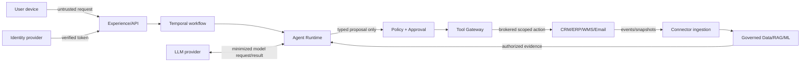

# System and Trust Boundaries

Status: Accepted v1.0
Owner: Principal Architecture + Security Architecture
Approver: Duong Vinh (Repository Owner)
Version: v1.0
Date: 2026-09-04

## Ownership boundary

| System/capability | RevPilot owns | External owner remains authoritative for | RevPilot must not do |
|---|---|---|---|
| Browser/API | RevPilot session/UI/API behavior | User device and enterprise network | Trust client tenant/role claims |
| Identity provider | Tenant mapping, authorization, delegation | Authentication, MFA, federation session | Store user passwords or elevate IdP claims |
| CRM | Canonical references, ingested snapshots, action ledger | Accounts, contacts, opportunities, tickets | Mutate records outside Tool Gateway |
| ERP/WMS | Analytical copies and evidence | Orders, inventory, fulfillment operations | Claim source-system ownership |
| Payment system | Payment status references and aggregates | Ledger, settlement, card data | Store card data or initiate money movement in MVP |
| Email/messaging | Approved intent, template/version, attempt/outcome | Delivery and recipient handling | Treat request timeout as delivery failure |
| LLM provider | Prompt/data minimization, routing, result validation | Model execution/provider controls | Grant tool authority or send secrets |
| Object storage | Object references, policy, lineage | Managed storage durability when outsourced | Treat object name as authorization |
| PostgreSQL | Transactional RevPilot state | Managed service infrastructure when outsourced | Become source of truth for external systems |
| Retrieval index | Rebuildable authorized search projection | Storage engine behavior | Return results without tenant/ACL/effective-date checks |
| Temporal | Workflow definitions/workers and application semantics | Service persistence/availability when managed | Put nondeterministic model/tool calls in workflow code |
| Connector provider | Connector configuration and sync state | External API semantics/rate/credential grants | Expose credential to Agent Runtime |

## Internal plane boundaries

| Crossing | Data/authority transferred | Enforcing component | Failure behavior |
|---|---|---|---|
| Experience -> Product API | User intent, session token, idempotency key | API authn/authz and trusted tenant resolver | Reject unauthenticated/ambiguous tenant |
| API -> Temporal | Immutable investigation scope and trusted Principal context reference | Application service + workflow input schema | No workflow creation on validation failure |
| Temporal -> Agent Runtime | Bounded task, capability catalog, budgets | Activity adapter + AgentRuntime port | Retry eligible activity or fail safe |
| Data/RAG -> Agent | Authorized evidence references and minimized content | Repository/index policy plus post-retrieval check | Mark evidence unavailable/incomplete |
| Agent -> Decision/Policy | Typed hypotheses/recommendations, never authority | Schema validator, deterministic constraints | Reject malformed/unsupported output |
| Policy -> Approval | Exact action/target/cost/policy digest | Approval service | Deny or wait; no execution |
| Approval -> Tool Gateway | Valid approval reference and immutable intent | Gateway reauthorization/revalidation | Fail closed on change/expiry |
| Tool Gateway -> External API | Scoped request plus brokered short-lived credential | Authorization, egress policy, credential broker | Record UNKNOWN and reconcile on ambiguity |
| All planes -> Audit | Minimized immutable security/business event | Audit policy, signing/integrity sink | High-risk write blocked if integrity cannot be preserved |

## External trust boundaries

## Trust-boundary rules

- Tenant and Principal context originates from verified server-side identity mapping, never request payload or model output.
- Documents, tickets, websites, connector data, model output, and Tool output are untrusted content; none grants authority.
- Agent Runtime can request only registered capabilities and never receives credentials.
- Tool availability is distinct from authorization. The Gateway enforces actor, delegation, tenant, policy, approval, budget, target, rate, egress, and idempotency.
- External provider success is authoritative only when confirmed by provider response/reconciliation; timeout is `UNKNOWN`.
- Derived stores are rebuildable and do not become independent authorization sources.

## Known unknowns

| Unknown | Owner | Blocks | Revisit trigger |
|---|---|---|---|
| Production cloud/regions | Architecture + Product | Provider-specific deployment/IAM | Before production adapter/infrastructure task |
| Initial hosted LLM provider and retention terms | AI + Security | Production provider adapter | Before non-mock model traffic |
| External connector idempotency/scoped-token support | Integrations + Security | Each real write adapter | Provider capability review |
| Legal retention/residency requirements | Product + Privacy/Legal | Regulated tier and deletion policy | Before commercial tenant contract |
| Initial production vertical | Product | Connector priority and domain defaults | Before Phase 01 acceptance |

