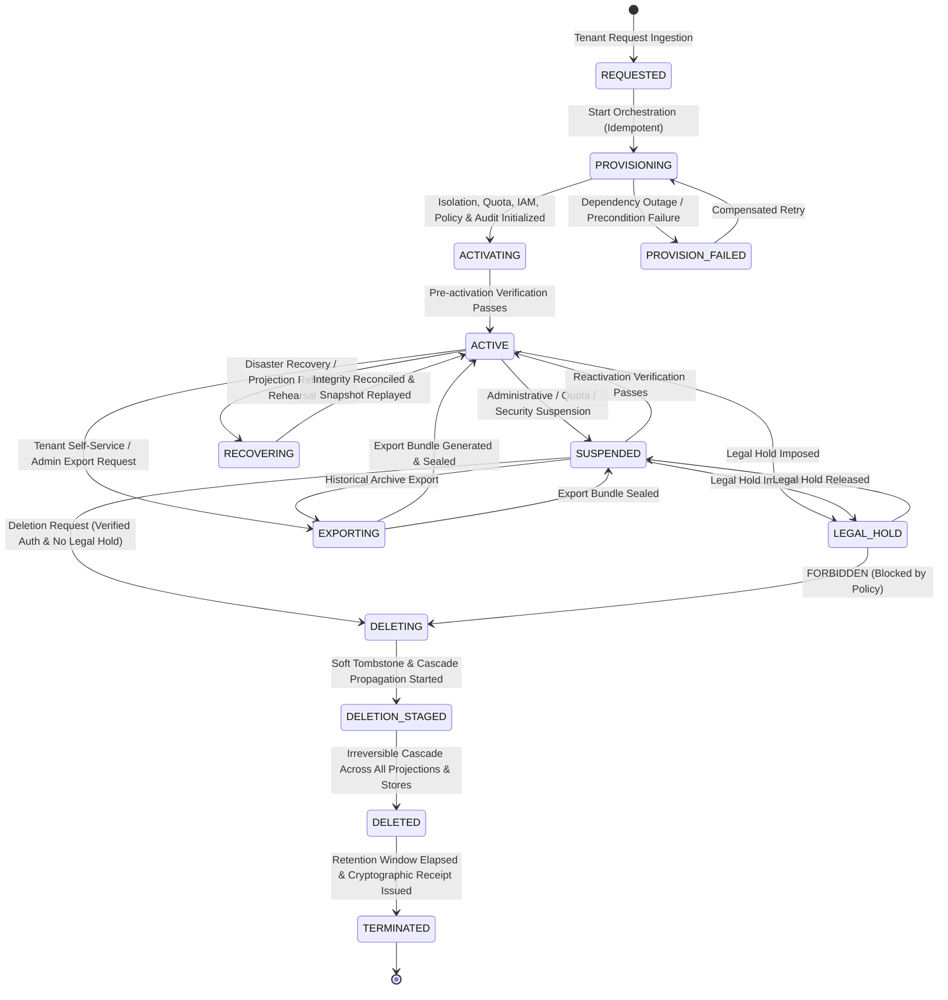

# Tenant Operations and Lifecycle Specification (Phase 07 Canonical Contract)

Status: Accepted Canonical Specification
Initiative: REVPILOT
Phase: Phase 07 — Multi-Tenant Pilot, Connectors, and Tenant Operations
Rail Alignment: Rail 2 (Tenant Context & Lifecycle), Rail 5 (Persistence Isolation Foundation), Rail 17 (Observability/FinOps/Audit)
Owners: Tenancy Architecture, Security Architecture, Data Governance
Traceability: `BR-004`, `FR-CTL-001`, `FR-CTL-003`, `INV-TEN-001`, `INV-TEN-002`, `INV-TEN-003`, `INV-SEC-001`, `INV-SEC-002`, `INV-DATA-001`, `INV-DATA-002`, `INV-AUD-001`, `INV-AUD-002`, `INV-COST-001`, `INV-PRV-001`, `INV-REL-001`, `INV-REL-002`, `NFR-TEN-001`, `NFR-TEN-002`, `NFR-SEC-001`, `NFR-REC-001`, `NFR-AUD-001`, `NFR-PRV-001`, `NFR-PRV-002`, `AC-010`, `ADR-0001`, `ADR-0005`, `ADR-0009`

---

## 1. Executive Summary and Lifecycle Invariants

This specification defines the authoritative lifecycle state machine, resource provisioning protocols, capability governance, export mechanics, deletion propagation, legal hold safeguards, and operational runbooks for commercial pilot tenants in RevPilot AI.

### 1.1 Non-Negotiable Tenancy Lifecycle Invariants
1. `INV-TEN-001` (Physical and Logical Isolation): Every tenant-owned persistent or derived record has enforceable tenant ownership. A query filter alone is legally and technically insufficient. Isolation boundaries are fully provisioned before any tenant activation.
2. `INV-TEN-002` (Server-Derived Authority): Tenant context is server-derived from verified authentication claims and authoritative database state. Client headers (`X-Tenant-ID`) or payload parameters are strictly untrusted.
3. `INV-TEN-003` (Fail-Closed Privileged Context): Platform administrative operations require explicit `PrivilegedContext(is_system=True)`. Setting `tenant_id = null`, `tenant_id = ""`, or using wildcard bypass is prohibited.
4. `NFR-TEN-001` (Zero Leakage): Cross-tenant data, cache, event, projection, vector, export, or audit leakage must equal exactly zero (0.0).
5. `NFR-TEN-002` (Isolation Preservation Under Stress): Isolation controls hold under degraded conditions and up to 120% peak capacity. Isolation controls are never disabled or relaxed to preserve system availability.
6. `INV-REL-001` (Fail-Closed State Uncertainty): Any dependency outage or ambiguity during tenant state transitions causes operations to fail closed. No tenant may be partially active.

### 1.2 Implementation acceptance boundary

The current in-memory tenancy implementation is not a production authority boundary. Before any lifecycle or context operation is exposed through an API, implementation must enforce verified caller authorization, duplicate-ID conflict handling, immutable/copy-safe aggregate boundaries, and expiry/revocation-aware contexts. Required evidence is a retained negative authorization suite, duplicate-ID suite, context-revocation suite, and PostgreSQL RLS concurrency evidence. Until then all lifecycle execution remains `IMPLEMENTATION PENDING`.
7. `NFR-PRV-002` (Legal Retention & Residency Uncertainty): Specific regulatory retention windows and geographic residency mandates remain `UNKNOWN` until formalized by legal counsel. The platform implements configurable governance boundaries without hardcoding unverified jurisdictions.

---

## 2. Complete Tenant Lifecycle State Machine



### 2.1 State Definitions

| State | Allowed Ingress | Allowed Workflow / Agent Execution | Allowed External Action | Allowed Export / Deletion | Read Boundary |
|---|---|---|---|---|---|
| `REQUESTED` | Admin only | None | None | None | Admin metadata only |
| `PROVISIONING` | Internal orchestration | Provisioning workflow | Resource allocation | None | None |
| `PROVISION_FAILED`| None | Remediation workflow | Rollback only | None | Operator diagnostic |
| `ACTIVATING` | Pre-activation probe | Isolation verification | None | None | Verification harness |
| `ACTIVE` | Normal API & Webhook | All authorized workflows | Governed Tool Gateway | Authorized exports | Full RLS / Tenant scope |
| `SUSPENDED` | Read-only admin / Billing| Paused / Cancelled | Blocked (100%) | Export only (Admin) | Degraded / Admin read |
| `LEGAL_HOLD` | Audit / Compliance read | Read-only compliance | Blocked (100%) | Export only (Compliance)| Read-only snapshot |
| `EXPORTING` | Ingress continues | Workflows continue | Governed Tool Gateway | Active export process | Point-in-time snapshot |
| `DELETING` | None (403 Deny) | Immediate cancellation | Blocked (100%) | In progress | None |
| `DELETION_STAGED`| None (403 Deny) | None | Blocked (100%) | Cascade purging | None |
| `DELETED` | None (404/410) | None | Blocked (100%) | Cryptographic receipt | None |
| `TERMINATED` | None (410 GONE) | None | Blocked (100%) | Terminal metadata only | None |
| `RECOVERING` | Ingress paused (503)| Replay / Rebuild workers | Blocked (100%) | Blocked | Recovery harness |

---

## 3. Detailed Transition Contracts

### 3.1 Transition: `REQUESTED` $\to$ `PROVISIONING`
- Current State: `REQUESTED`
- Next State: `PROVISIONING`
- Actor: `TenantProvisioningWorker` or `PlatformAdmin`
- Authority: `tenant:provision` permission with verified `PrivilegedContext`
- Preconditions:
  1. Valid, unique `TenantId` allocated conforming to regex `^ten_[a-z0-9]{8,32}$`.
  2. Target subscription tier defined (`SHARED`, `ENTERPRISE`, `REGULATED`).
  3. Designated initial Tenant Admin email and organizational metadata validated.
- Idempotency: Keyed by `provision_req_{tenant_id}_{schema_version}`. Duplicate invocations yield existing state.
- Tenant Scope: Explicit single `tenant_id`.
- Audit Event: `tenancy.provisioning.started` containing `tenant_id`, `tier`, `requested_by`.
- Failure Behavior: Fails closed. Marks state `PROVISION_FAILED`. Emits `tenancy.provisioning.failed`.
- Retry Behavior: Exponential backoff, maximum 3 retries.
- Rollback: Reverses allocated database schemas/keys if partial failure occurs.

### 3.2 Transition: `PROVISIONING` $\to$ `ACTIVATING`
- Current State: `PROVISIONING`
- Next State: `ACTIVATING`
- Actor: `TenantProvisioningSaga`
- Authority: Internal Temporal system authority (`revpilot-system`)
- Preconditions (All must evaluate `TRUE`):
  1. Relational storage provisioned: Tenant RLS row allocated in `tenants` table; dedicated schema or composite keys established (`DATABASE-SCHEMA.md` §19, §21).
  2. Cache boundary allocated: Redis namespace prefix `{tenant_id}:` confirmed.
  3. Object storage isolated: S3 prefix `{tenant_id}/` created with strict bucket policy.
  4. Vector / RAG collection partitioned: Collection metadata registered with mandatory pre-filter `tenant_id == :tenant_id`.
  5. Default quotas registered in `tenant_quotas` table (`FINOPS-SPEC.md`).
  6. Default RBAC policies and tenant admin role initialized.
  7. Audit log partition and cryptographic integrity cursor initialized.
  8. Secrets reference namespace created; NO real credentials ingested.
- Idempotency: Checkpointed via Temporal saga state machine.
- Audit Event: `tenancy.provisioning.resources_allocated`.
- Failure Behavior: Any failed step halts workflow; compensation deletes allocated resources.
- Operator Runbook: `RB-TEN-001: Remediation of Failed Tenant Provisioning`.

### 3.3 Transition: `ACTIVATING` $\to$ `ACTIVE`
- Current State: `ACTIVATING`
- Next State: `ACTIVE`
- Actor: `TenantActivationVerifier`
- Authority: `tenant:activate`
- Preconditions:
  1. Automated isolation probe (`TEST-TEN-001..011`) passes 100% on target tenant boundary.
  2. Mock connector health check passes.
  3. Zero orphaned resources detected.
  4. Explicit sign-off by Provisioning Orchestrator.
- Idempotency: Safe to re-verify; updates `activated_at` timestamp once.
- Audit Event: `tenancy.lifecycle.activated`.
- Failure Behavior: Remains in `ACTIVATING` or reverts to `PROVISION_FAILED`. Never activates partially.

### 3.4 Transition: `ACTIVE` $\to$ `SUSPENDED`
- Current State: `ACTIVE`
- Next State: `SUSPENDED`
- Actor: `TenantAdmin`, `PlatformAdmin`, or `AutomatedQuotaGuard`
- Authority: `tenant:suspend`
- Preconditions:
  1. Valid suspension reason code (`QUOTA_EXHAUSTED`, `PAYMENT_DEFAULT`, `SECURITY_BREACH_SUSPECTED`, `ADMIN_MANUAL`).
  2. Nonce and justification logged.
- Idempotency: Calling suspend on an already suspended tenant returns current status (no-op).
- Ingress Behavior: 100% of user API requests and inbound connector webhooks rejected with 403 `TENANCY_VIOLATION: Tenant is suspended`.
- Workflow Behavior: Ongoing Temporal workflows for this tenant receive immediate `Pause` signal; background activities terminate.
- Tool Gateway Behavior: 100% of external actions immediately blocked.
- Audit Event: `tenancy.lifecycle.suspended` (Unsampled, signed).
- Rollback / Reactivation: Operator triggers reactivation pipeline via `RB-TEN-002`.

### 3.5 Transition: `SUSPENDED` $\to$ `ACTIVE` (Reactivation)
- Current State: `SUSPENDED`
- Next State: `ACTIVE`
- Actor: `TenantAdmin` (for quota/billing resolution) or `PlatformAdmin` (for security holds)
- Authority: `tenant:reactivate`
- Preconditions:
  1. Root cause of suspension resolved (e.g. quota reset, billing clearance, security review passed).
  2. Security audit verifies zero persistent compromise.
  3. Reactivation verification suite passes.
- Idempotency: Idempotent reactivation call returns `ACTIVE`.
- Audit Event: `tenancy.lifecycle.reactivated`.
- Workflow Behavior: Workflows resume from checkpointed state or trigger deterministic reconciliation.

### 3.6 Transition: `ACTIVE` / `SUSPENDED` $\to$ `LEGAL_HOLD`
- Current State: `ACTIVE` or `SUSPENDED`
- Next State: `LEGAL_HOLD`
- Actor: `ComplianceOfficer` or `PlatformAdmin`
- Authority: `compliance:legal_hold:apply`
- Preconditions:
  1. Formal matter reference ID and legal justification recorded.
  2. Automated deletion timers and retention purges suspended immediately.
- Idempotency: Idempotent; records supplementary matter references.
- Ingress & Capabilities: Read-only access to compliance auditors; zero mutating actions or tool execution permitted.
- Critical Rule: All deletion workflows targeting a tenant in `LEGAL_HOLD` fail closed immediately with error `LEGAL_HOLD_ACTIVE` (409).
- Audit Event: `compliance.legal_hold.applied`.

### 3.7 Transition: `LEGAL_HOLD` $\to$ `SUSPENDED`
- Current State: `LEGAL_HOLD`
- Next State: `SUSPENDED`
- Actor: `ComplianceOfficer`
- Authority: `compliance:legal_hold:release`
- Preconditions: Legal counsel formal release authorization signed and hashed.
- Audit Event: `compliance.legal_hold.released`.

### 3.8 Transition: `ACTIVE` / `SUSPENDED` $\to$ `EXPORTING` $\to$ (`ACTIVE` / `SUSPENDED`)
- Current State: `ACTIVE` or `SUSPENDED`
- Next State: `EXPORTING` (temporary operational substate)
- Actor: `TenantAdmin` or `Auditor`
- Authority: `tenant:export`
- Preconditions:
  1. Target storage URI or pre-signed delivery channel verified.
  2. Encryption public key provided or platform envelope key assigned.
- Export Execution Contract:
  - Strict Tenant Scoping: Selects records strictly where `tenant_id == :target_tenant_id`. Cross-tenant data co-mingling equals zero.
  - Snapshot Consistency: Export executes against an isolated database read replica or transaction snapshot with isolation level `REPEATABLE READ`.
  - Projections & Storage: Gathers canonical relational rows, RAG chunks, ticket summaries, action ledger records, and raw audit entries matching tenant.
  - Redaction & Minimization: Redacts all provider secret references, internal infrastructure identifiers, and cross-tenant indexes.
  - Integrity Sealing: Export package is packaged as a standard archive (e.g. tar.zst) accompanied by a SHA-256 cryptographic manifest digest.
- Audit Event: `tenancy.data.export_generated`.

### 3.9 Transition: `SUSPENDED` $\to$ `DELETING` $\to$ `DELETION_STAGED` $\to$ `DELETED` $\to$ `TERMINATED`
- Current State: `SUSPENDED` (Deletion cannot be directly initiated from `ACTIVE` without suspension pre-check)
- Next State: `DELETING`
- Actor: `TenantAdmin` + Dual Authorization `PlatformAdmin`
- Authority: `tenant:delete`
- Preconditions (Strict Fail-Closed):
  1. Tenant must NOT be in `LEGAL_HOLD`. If in `LEGAL_HOLD`, delete fails closed (409).
  2. Dual approval signature verified (`INV-ACT-003`).
  3. Grace period verification completed.
- Cascade Deletion Propagation Order:
  ```text
  Step 1: Soft-tombstone in PostgreSQL `tenants` table (sets deleted_at, status=DELETING)
  Step 2: Revoke 100% active sessions, JWT tokens, OIDC/SAML bindings, and SCIM mappings
  Step 3: Purge cache: Invalidate all Redis keys matching prefix `{tenant_id}:*`
  Step 4: Purge vector indexes: Delete all embeddings and metadata matching `tenant_id`
  Step 5: Purge search projections: Remove all full-text and ticket intelligence indices
  Step 6: Purge object storage: Recursively delete S3/blob prefix `{tenant_id}/*`
  Step 7: Purge relational data: Cascade delete across all tenant-partitioned SQL tables
  Step 8: Purge workflow state: Terminate and delete Temporal workflow executions and histories
  Step 9: Purge connector state: Delete connector cursors, sync configs, and secret references
  Step 10: Purge ML projections: Invalidate cached features, uplift scores, and segmentations
  Step 11: Audit log handling: Audit logs are preserved in append-only archive with payload redaction,
           retaining ONLY cryptographic proof of deletion (`tenancy.deletion.completed`)
  ```
- Dependency Failure Rule: If any subsystem (e.g. vector store or object storage) fails during cascade deletion, the workflow does NOT mark the tenant `DELETED`. It pauses, flags `DELETION_STAGED_FAILED`, alerts SRE, and retries until verified complete.
- Deletion Verification: A post-deletion scan executes `TEST-TEN-001..011` against all storage engines. If any record survives, the process fails closed.
- Terminal Receipt: Generates an immutable, signed Deletion Certificate (`DeletionDigestRecord`) containing SHA-256 proofs of purged partitions.
- Audit Event: `tenancy.data.deletion_completed`.

---

## 4. Disaster Recovery, Rehearsal, and Rebuild Operations

### 4.1 Rebuildable Projections (`INV-DATA-002`)
In the event of index corruption, schema drift, or migration:
1. Canonical operational store (PostgreSQL) is the sole source of truth.
2. Vector databases, Elasticsearch/BM25 indexes, Redis caches, and ML feature tables are rebuildable projections.
3. Rebuild workflow parses historical events/records bounded by `:as_of_time` and populates clean target collections without business downtime.

### 4.2 Recovery Rehearsal Protocol
To validate pilot readiness:
- Rehearsal Environment: Dedicated non-production staging cluster.
- Ingestion Replay: Replays 7 days of outbox events and webhook payloads.
- Parity Check: Compares rebuilt vector embeddings and analytics summaries with primary ground truth. Target parity: 100%.
- Duration: Target RTO $\le 30$ minutes, RPO $\le 5$ minutes (`DR-PLAN.md`).

---

## 5. Summary Error Matrix

| Error Code | HTTP Status | Trigger Condition | System Behavior |
|---|---:|---|---|
| `TENANT_NOT_FOUND` | 404 | Non-existent tenant identifier supplied | Deny access, log audit attempt |
| `TENANT_SUSPENDED` | 403 | Request targeting suspended tenant | Block ingress and action dispatch |
| `TENANT_INACTIVE` | 403 | Request targeting tenant in `PROVISIONING` or `DELETED` | Block access immediately |
| `LEGAL_HOLD_ACTIVE` | 409 | Deletion requested on tenant with legal hold | Block deletion, alert compliance |
| `DELETION_INCOMPLETE` | 500 | Storage engine failed to confirm purge | Fail closed, alert SRE runbook |
| `ISOLATION_VERIFICATION_FAILED` | 500 | Post-provisioning isolation probe failed | Block tenant activation, rollback |
