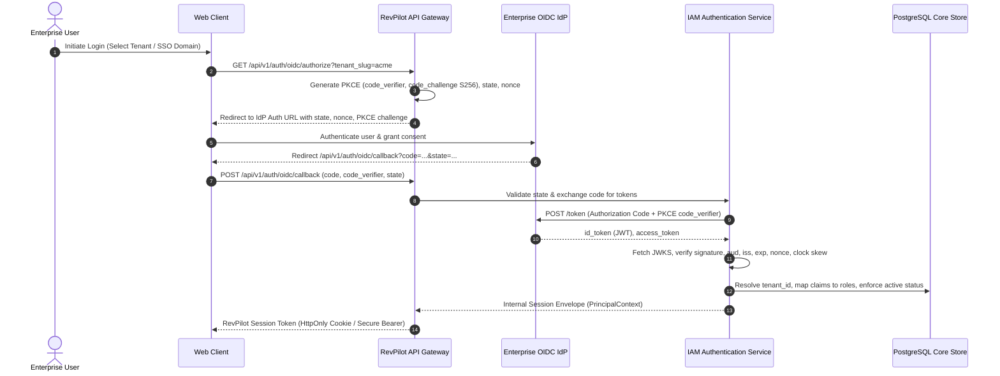
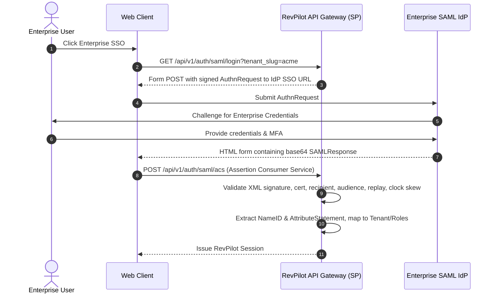

# Enterprise Identity Integration Specification (Phase 07 Canonical Contract)

Status: Accepted Canonical Specification
Initiative: REVPILOT
Phase: Phase 07 — Multi-Tenant Pilot, Connectors, and Tenant Operations
Rail Alignment: Rail 3 (Authentication), Rail 4 (Authorization & Delegation), Rail 17 (Observability/FinOps/Audit)
Owners: Security Architecture, IAM Module
Traceability: `BR-004`, `FR-CTL-001`, `INV-IAM-001`, `INV-IAM-002`, `INV-TEN-001`, `INV-TEN-002`, `INV-TEN-003`, `INV-SEC-001`, `INV-SEC-002`, `INV-AUD-001`, `INV-AUD-002`, `INV-REL-001`, `NFR-SEC-001`, `NFR-SEC-002`, `NFR-TEN-001`, `NFR-AUD-001`, `NFR-PRV-001`, `AC-010`, `ADR-0005`, `ADR-0009`

---

## 1. Executive Summary and Architectural Invariants

This specification defines the provider-neutral canonical contracts for integrating enterprise identity providers (IdPs) into RevPilot AI. It specifies OpenID Connect (OIDC) as the primary commercial pilot protocol, followed by Security Assertion Markup Language (SAML 2.0) for legacy enterprise federations, and System for Cross-domain Identity Management (SCIM 2.0) for automated user/group lifecycle provisioning.

### 1.1 Foundational Identity Invariants
1. `INV-IAM-001`: Authorization is deny-by-default and evaluated server-side at every sensitive capability boundary.
2. `INV-TEN-002`: Tenant context is server-derived from authenticated IdP membership mapping and active tenant status; client-supplied tenant hints (`X-Tenant-ID`, query params, form fields) are strictly untrusted.
3. `INV-SEC-001`: External IdP tokens, assertion XML, access keys, or user credentials never reach the Agent Runtime. Agents receive only scoped, short-lived `DelegationToken` references.
4. **Zero Password Storage**: RevPilot stores no human user passwords, password hashes, or raw IdP secret credentials.
5. **No Blind Privilege Escalation**: External IdP groups or claims do not automatically grant high-privilege platform roles (`platform_admin` or `approval:tier_3`). All group-to-role mappings are explicitly bound to tenant policy.
6. **Provider-Neutral Architecture**: Specifications do not hardcode a single production IdP vendor (e.g. Okta, Azure AD, Ping, Keycloak). The system interfaces strictly with standard OIDC, SAML, and SCIM protocol abstractions.

---

## 2. Protocol 1: OpenID Connect (OIDC) Federation Contract

OIDC is the mandatory baseline authentication mechanism for Phase 07 commercial pilots.



### 2.1 OIDC Configuration Envelope
Each tenant configuring OIDC registers a tenant-scoped configuration:

```python
class OidcTenantConfiguration(BaseModel):
    tenant_id: TenantId
    issuer_url: HttpUrl                       # Must be HTTPS
    client_id: str
    client_secret_ref: SecretReference       # Broker reference, never raw value
    redirect_uri: HttpUrl                     # https://app.revpilot.ai/auth/oidc/callback
    allowed_clock_skew_seconds: int = 60      # Maximum tolerance
    scopes: List[str] = ["openid", "profile", "email"]
    jwks_uri: HttpUrl
    jwks_refresh_interval_minutes: int = 60
    claim_mapping: OidcClaimMapping
    jit_provisioning_enabled: bool = True
    session_max_age_seconds: int = 28800     # 8 hours maximum
```

### 2.2 Strict Token Validation Rules
1. **Issuer Verification (`iss`)**: Must strictly match configured `issuer_url`. Any discrepancy raises `AUTHENTICATION_ERROR` (401).
2. **Audience Verification (`aud`)**: Must contain RevPilot's registered `client_id`. Reject if missing or mismatched.
3. **Signature Verification & JWKS Key Rotation**:
   - Validated against cryptographic public keys from `jwks_uri`.
   - Keys are cached with TTL. If a token presents an unknown `kid`, JWKS is re-fetched once. If still unknown, token is rejected.
   - Algorithms permitted: `RS256`, `RS384`, `RS512`, `ES256`, `ES384`, `ES512`. Insecure algorithm `none` is structurally prohibited.
4. **Timestamp & Clock Skew Evaluation**:
   - `exp`: Evaluated with max 60s clock skew: `now >= (exp + 60s) ==> TOKEN_EXPIRED`.
   - `nbf`: Evaluated with max 60s clock skew: `now < (nbf - 60s) ==> TOKEN_NOT_YET_VALID`.
5. **Nonce & State Binding**:
   - `state`: Cryptographically random 256-bit token stored in encrypted session cookie. Callback must match exact state to prevent CSRF.
   - `nonce`: Cryptographically random token embedded in authorization request. Must match `nonce` claim in `id_token` to prevent token injection / replay.
6. **Replay Protection**:
   - `jti` (JWT ID) is recorded in an in-memory / Redis cache with TTL equal to token remaining lifetime. A duplicate `jti` raises `TOKEN_REPLAY_DETECTED` (401) and triggers security alert.

### 2.3 Claims Normalization and Tenant Mapping
- `sub` (Subject): Stable external user identifier. Mapped to `external_subject_id`.
- `email`: Normalized to lowercase trimmed string.
- `roles` / `groups`: IdP groups are extracted from configured claim (e.g. `groups` or `roles`) and mapped using tenant-specific mapping table:
  ```text
  IdP "SecOps_Admins"      ==> RevPilot Role: "tenant_admin"
  IdP "Revenue_Analysts"   ==> RevPilot Role: "analyst"
  IdP "General_Users"      ==> RevPilot Role: "operator"
  Unmapped IdP Groups      ==> Denied all sensitive permissions (default deny)
  ```
- **Duplicate Subject Handling**: If `(issuer, sub)` matches an existing user under Tenant A, but request attempts to bind to Tenant B, request fails closed with `CROSS_TENANT_IDENTITY_COLLISION` (409) unless formal multi-tenant linking is provisioned.
- **Deprovisioned User**: If a user is deactivated in RevPilot or suspended in IdP, token validation fails closed (`USER_DEPROVISIONED`).

### 2.4 Logout and Session Revocation
- **RP-Initiated Logout**: RevPilot invalidates local session and redirects user to IdP `end_session_endpoint` with `id_token_hint`.
- **Back-Channel Logout**: RevPilot exposes `POST /api/v1/auth/oidc/backchannel-logout`, verifies logout token signature and `events` claim (`http://schemas.openid.net/event/backchannel-logout`), and immediately invalidates all active sessions for `sub`.

---

## 3. Protocol 2: SAML 2.0 Enterprise Federation Contract

SAML 2.0 provides legacy enterprise federation for organizations unable to use OIDC.



### 3.1 SAML Security Contract
1. **Metadata & Endpoints**:
   - EntityID: `https://api.revpilot.ai/saml/{tenant_id}/sp`
   - ACS (Assertion Consumer Service): `https://api.revpilot.ai/saml/{tenant_id}/acs` (Binding: `HTTP-POST`)
   - Single Logout Service (SLO): `https://api.revpilot.ai/saml/{tenant_id}/slo` (Binding: `HTTP-Redirect` / `HTTP-POST`)
2. **Signature Validation**:
   - Assertion MUST be digitally signed by IdP X.509 certificate.
   - SHA-1 signatures are rejected. Permitted signature digests: `SHA-256`, `SHA-384`, `SHA-512`.
   - XML Signature Wrapping (XSW) attacks are mitigated by validating signatures strictly on parsed canonical DOM nodes (`c14n`).
3. **Audience & Recipient Verification**:
   - `AudienceRestriction` MUST contain exact RevPilot SP EntityID.
   - `SubjectConfirmationData` `Recipient` MUST match exact ACS URL.
4. **Replay Protection**:
   - Assertion ID (`ID` attribute) is logged with expiration timestamp matching `NotOnOrAfter`. Duplicate Assertion IDs are rejected (`SAML_ASSERTION_REPLAYED`).
5. **Certificate Rotation**:
   - Tenant SAML config supports dual active X.509 certificates (current and next) to allow zero-downtime certificate rotation.

---

## 4. Protocol 3: SCIM 2.0 Automated Lifecycle Provisioning Contract

SCIM 2.0 (RFC 7643 / RFC 7644) allows enterprise IdPs to push real-time user and group provisioning, updates, and deprovisioning to RevPilot.

### 4.1 SCIM Endpoints and Authentication
- Base URL: `https://api.revpilot.ai/scim/v2/{tenant_id}/`
- Authentication: Bearer token generated per tenant with scope `scim:sync`. Token is hashed using Argon2id in storage.
- Endpoints:
  - `GET /Users`: Paginated user search (`startIndex`, `count`, `filter`).
  - `POST /Users`: Provision new user.
  - `GET /Users/{id}`: Retrieve user details.
  - `PUT /Users/{id}`: Full user update.
  - `PATCH /Users/{id}`: Partial update (e.g. set `active: false`).
  - `DELETE /Users/{id}`: Deprovision user (soft-delete / disable).
  - `GET /Groups`, `POST /Groups`, `PUT /Groups/{id}`, `PATCH /Groups/{id}`, `DELETE /Groups/{id}`: Group management.

### 4.2 Provisioning and Deprovisioning Rules
1. **User Deactivation (`active: false`)**:
   - When SCIM PATCH sets `active: false` or DELETE is received:
   - User status is immediately transitioned to `DEACTIVATED`.
   - All active web sessions and API tokens for this user are revoked within 1000ms.
   - Any active human approval requests assigned to this user are revoked and re-routed.
2. **Group Mapping Reconciliation**:
   - SCIM Group memberships map directly to RevPilot internal roles.
   - Removing a user from a group in SCIM immediately removes the corresponding RevPilot role upon webhook receipt.
3. **Idempotency and Concurrency**:
   - Requests support `ETag` and `If-Match` headers based on `version` integer.
   - Concurrency conflicts return 412 `Precondition Failed`.
4. **Out-of-Order Updates**:
   - Every SCIM modification updates an internal `last_synced_version`. Stale updates with lower timestamps are discarded.

---

## 5. Audit Logging and Security Monitoring

Every enterprise identity event generates an immutable audit record:

| Event Name | Trigger | Audit Payload |
|---|---|---|
| `identity.oidc.login_success` | User authenticated via OIDC | `tenant_id`, `sub`, `email`, `mapped_roles`, `ip`, `user_agent` |
| `identity.oidc.login_failure` | Invalid token, signature, or clock skew | `tenant_id`, `reason`, `error_code`, `ip` (NO tokens/passwords) |
| `identity.oidc.token_replay` | Detected duplicate JTI | `tenant_id`, `jti`, `ip`, `alert_severity: CRITICAL` |
| `identity.saml.acs_success` | Valid SAML assertion processed | `tenant_id`, `name_id`, `mapped_roles`, `session_index` |
| `identity.saml.signature_invalid` | Malformed or forged SAML XML | `tenant_id`, `error_detail`, `ip`, `alert_severity: HIGH` |
| `identity.scim.user_provisioned` | New user created via SCIM | `tenant_id`, `user_id`, `email`, `initial_roles` |
| `identity.scim.user_deactivated` | User suspended/deleted via SCIM | `tenant_id`, `user_id`, `revoked_sessions_count` |
| `identity.scim.group_updated` | Group membership synced via SCIM | `tenant_id`, `group_id`, `added_members`, `removed_members` |
