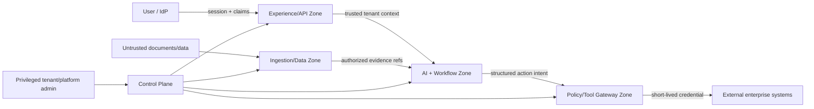

# RevPilot AI Threat Model

Status: Proposed v0.1  
Basis: User-supplied target architecture and the Foundation Pack; no application source exists yet.  
Review note: This architecture pass was performed sequentially because independent delegation was not available for this task. Scenarios are design hypotheses, not validated vulnerabilities.

## 1. Overview

RevPilot is a multi-tenant revenue decision-and-action platform. Users enter through the web/API. A product API creates a durable Temporal investigation. An agent runtime plans bounded read operations against analytics, RAG, ML, and causal services. Recommendations pass through policy and human approval. All side effects go through a Tool Gateway that brokers short-lived credentials to external CRM/ERP/WMS/messaging systems. Connectors ingest external data into governed raw and canonical stores. A Control Plane supplies tenant, identity, secrets, quota, audit, and release controls. This flow is the proposed design recorded in `docs/04-system-architecture/SYSTEM-ARCHITECTURE.md:5`, `:11`, and `:62`; those references are design evidence, not proof of an implemented control.

### Components and evidence basis

| Component | Security role | Current evidence |
|---|---|---|
| Experience/API | Authenticate session, derive trusted tenant context, prevent browser/API abuse | Proposed in `docs/04-system-architecture/SYSTEM-ARCHITECTURE.md:11` |
| Temporal + agent runtime | Durable state and bounded reasoning; agent output remains untrusted | Proposed architecture only |
| Data/RAG/ML | Tenant-scoped data, evidence provenance, reproducible model inputs | Proposed architecture only |
| Policy + approval | Enforce authority, risk tier, payload-bound approval | Proposed invariant only |
| Tool Gateway | Sole side-effect path and credential broker | Proposed in `README.md:7` and `docs/04-system-architecture/SYSTEM-ARCHITECTURE.md:62` |
| Control Plane | Tenant/IAM/keys/quota/audit/release controls | Proposed in `docs/04-system-architecture/SYSTEM-ARCHITECTURE.md:11` |

### Effective-resource table

| Deployment/workflow | Resource/capability | Configuration and precedence | Safe effective value/location | Readers/writers/recipients | Enforcing control | Evidence/unknowns |
|---|---|---|---|---|---|---|
| MVP | Business actions | Build profile overrides adapters | Mock/dry-run ledger only | Authorized user and test services | Adapter registry + policy | Must be proven by implementation test |
| Shared tenant tier | PostgreSQL rows | Server-derived tenant context overrides request fields | Tenant-scoped RLS rows | Authorized app roles | PostgreSQL RLS + composite keys | Policy SQL not yet implemented |
| Retrieval | Documents/chunks/index | Source ACL + tenant + effective date all intersect | Tenant namespace/partition | RAG service and authorized user | Index filter plus post-retrieval authorization | Backend selection pending ADR |
| External action | CRM/ERP credential | Vault/broker policy overrides agent intent | Short-lived scoped credential; never prompt/context | Credential broker and external API | IAM/ABAC + Tool Gateway | Provider capability varies |
| Audit | Immutable event metadata | Minimization policy precedes sink retention | Hash/digest metadata; encrypted payload separate | Auditors/security | Signing, hash chain, WORM at v1 | Storage vendor pending ADR |
| Model release | Production artifact | Release gate overrides developer request | Registry-approved version only | Serving runtime | Signed manifest + deployment policy | CI/CD design pending |

## 2. Assets, trust boundaries, and assumptions

### Protected assets

- Tenant business data, contracts, customer PII, financial and revenue data.
- Tenant isolation and region/residency guarantees.
- User, service, connector, and delegated agent identities.
- External-system credentials, encryption keys, signing keys, approval authority.
- Integrity of metrics, evidence, model/prompt/policy versions, decisions, approvals, actions, outcomes, billing, and audit history.
- Availability and cost budgets of models, tools, connectors, and workflows.

### Security objectives

- `SEC-001`: A tenant can neither observe nor affect another tenant's data or execution.
- `SEC-002`: Agents receive capabilities, not reusable secrets or administrative authority.
- `SEC-003`: Tool authorization uses server-verified identity/tenant/delegation context, never LLM-provided claims.
- `SEC-004`: Retrieved documents, tickets, websites, and tool output are untrusted data and cannot modify instructions, policy, or authority.
- `SEC-005`: Approval is specific to action/targets/cost/version/expiry and cannot be replayed.
- `SEC-006`: Side effects are idempotent or reconciled; uncertain outcomes are not blindly retried.
- `SEC-007`: Policy/IAM/audit uncertainty fails closed for writes.
- `SEC-008`: Model, prompt, tool schema, policy, index, and dataset changes are versioned and release-gated.
- `SEC-009`: Sensitive audit payload is minimized and separately encrypted; WORM is not a raw prompt archive.
- `SEC-010`: Kill switches are independent of the AI path and are tested.

### Actors and attacker capabilities

| Actor | May initially control | Must not be assumed to control |
|---|---|---|
| Tenant user | Their own prompts, permitted uploads, browser/API calls | Another tenant, platform admin, connector secrets |
| Malicious document author | Content later ingested into tickets/contracts/pages | Policy engine, system prompt, gateway authority |
| Compromised tenant connector | Data/events and provider-granted scope for one tenant | Other tenant scopes or platform keys |
| Internet attacker | Public endpoints and unauthenticated inputs | Valid session or private network by default |
| Insider/admin | Assigned operational role | All roles simultaneously; separation of duties is required |
| Supply-chain attacker | A compromised dependency/model/artifact if that prerequisite occurs | Signing/release infrastructure automatically |

### Primary trust boundaries

1. Browser/client to API: session, CSRF/origin, input validation, tenant derivation.
2. API/workflow to agent/model: prompt injection, structured output validation, cost/tool limits.
3. Data ingestion to governed stores: parser isolation, malware, schema drift, provenance, poisoning.
4. Retrieval to agent: tenant/source ACL, effective date, untrusted-content labeling.
5. Agent to Tool Gateway: capability and argument authorization, confused deputy prevention.
6. Approval UI to execution: approver authority, exact digest binding, expiry and replay protection.
7. Gateway to external provider: credential scope, SSRF/egress, idempotency and reconciliation.
8. Control Plane to all planes: privileged change, key/tenant lifecycle, audit and kill switches.
9. Build/model supply chain to runtime: artifact provenance, signing, evaluation gates.

### Assumptions and unknowns

- The initial production cloud and managed services are undecided; network/IAM guarantees are conditional.
- External providers differ in idempotency, scoped-token, webhook-signing, and reconciliation support.
- The initial vertical and applicable legal retention/residency obligations require product/legal input.
- No source code or deployment manifests exist, so no control is validated.
- OAuth redirect, browser-origin, file parsing, and model-serving boundaries must be refined in their detailed specs.

## 3. Prioritized attacker stories and mitigations

| Priority | Scenario and capability gain | Prerequisites | Impact | Required controls | Additional mitigation/validation |
|---|---|---|---|---|---|
| Critical | Cross-tenant query/index/cache bug exposes or changes another tenant's records | Shared tier and missing enforcement | Confidentiality/integrity breach at SaaS scale | RLS, tenant composite keys, namespace policy, trusted context | Negative matrix across DB/vector/search/cache/events/exports; fail build on leak |
| Critical | Prompt injection causes unauthorized external action | Malicious ticket/document reaches agent and gateway trusts model | Financial/customer harm | Tool Gateway, server-side auth, policy, approval digest, least privilege | Taint untrusted text, typed tools, adversarial eval, no authority in prompts |
| Critical | Approval replay or payload swap expands recipients/cost | Weak approval binding | Mass action beyond consent | Signed digest, nonce, expiry, target/cost caps, revalidation | Mutation/replay tests and immutable action ledger |
| High | Confused deputy uses a valid user's connector for a different tenant/scope | Incorrect delegation propagation | Unauthorized data/tool access | Tenant-bound delegated identity and per-tool ABAC | Prove full call-chain context; deny client-supplied tenant override |
| High | Duplicate or ambiguous retry sends vouchers/messages twice | Timeout after provider accepted action | Financial/reputation loss | Idempotency, outbox, intent ledger, provider reconciliation | Treat unknown separately; provider-specific retry matrix |
| High | SSRF or malicious connector/tool schema reaches internal services | Agent-controlled URL or compromised registry | Secret/internal service access | Destination allowlist, egress proxy, DNS/IP validation, signed registry | Re-resolve on connect; metadata endpoint block; contract tests |
| High | Poisoned RAG document fabricates policy/SLA or instructions | Attacker can submit source content | Incorrect decision/action | Source trust level, ACL, version/effective date, citation verification | Independent authoritative policy store; quarantine and review |
| High | Stolen long-lived connector secret enables persistent provider access | Secret exposed to logs/prompt/runtime | External account compromise | Brokered short-lived credentials, vault, rotation, redaction | Canary detection; revoke and audit workflows |
| High | Platform/admin account bypasses separation of duties | Privileged credential compromise | Broad tenant/control-plane compromise | MFA, JIT access, dual control, immutable audit | Break-glass procedure, session recording, periodic access review |
| Medium | Model loop or adversarial query consumes tenant/platform budget | Authenticated or exposed request path | Availability/cost harm | Token/tool/time budgets, rate limits, circuit breaker | Per-tenant kill switch and cost anomaly alerts |
| Medium | Forged/duplicate/out-of-order webhook corrupts canonical state | Public webhook endpoint | False anomalies/decisions | Signature/timestamp/replay checks, dedup, event-time semantics | Reconciliation/backfill and source sequence tracking |
| Medium | Schema drift silently changes metric meaning | Connector source changes | Wrong business conclusions | Data contracts, quarantine, quality gates, versioned metrics | Semantic reconciliation; no auto-map high-risk fields |
| Medium | Model/dependency artifact is replaced or regresses | Supply-chain compromise or weak release | Systematic unsafe output | Pinned artifacts, provenance/signing, SBOM, eval/canary gates | Independent rollback and artifact revocation |
| Medium | Raw prompts/evidence in telemetry or WORM violate privacy | Broad logging defaults | Sensitive-data retention/exposure | Data minimization, structured audit metadata, encryption, access limits | DLP tests and retention/deletion propagation |
| Low | User manipulates only their own draft investigation | No authority elevation or external action | Self-only incorrect draft | Clear draft state and evidence display | Preserve as non-security product-quality issue unless scope changes |

## 4. Severity calibration

- Critical: reachable cross-tenant compromise, broad credential/key compromise, or unauthorized high-impact action with no effective approval/gateway boundary. A malicious prompt alone is not Critical if it cannot gain tool authority.
- High: material single-tenant data compromise, privileged action, persistent external credential abuse, or bypass of approval/idempotency with significant impact. Strong provider scope and hard caps may reduce severity.
- Medium: bounded integrity, availability, privacy, or cost impact requiring authenticated/tenant-local access and contained by budgets/recovery.
- Low: self-only draft manipulation, minor metadata disclosure, or defense-in-depth weakness without meaningful new capability.

Severity and confidence are separate. All scenarios above remain hypotheses until implementation and deployment evidence is reviewed.
