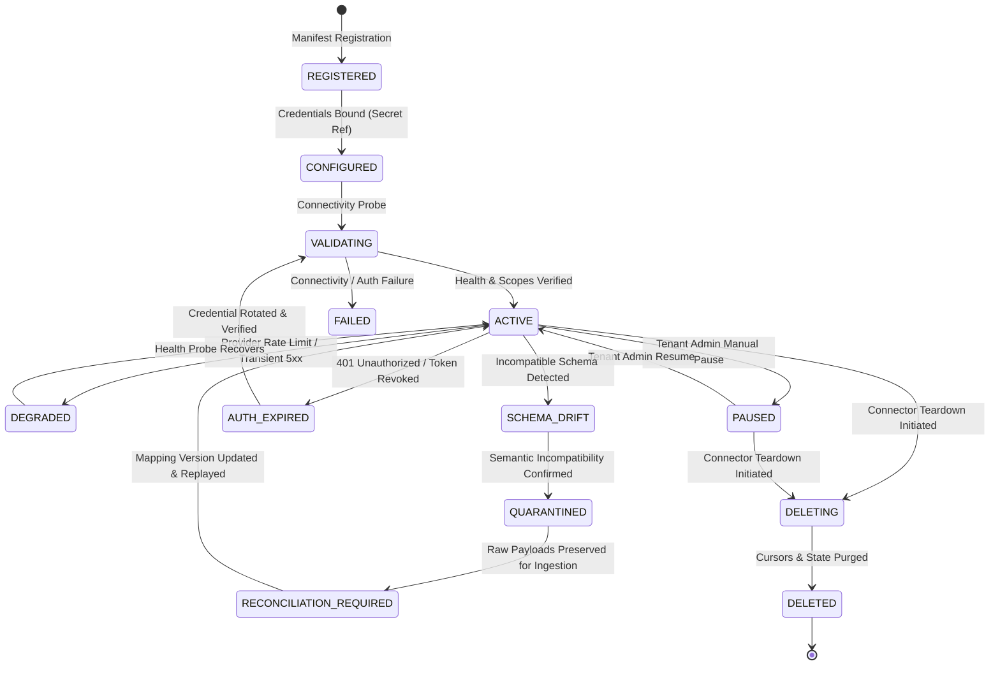
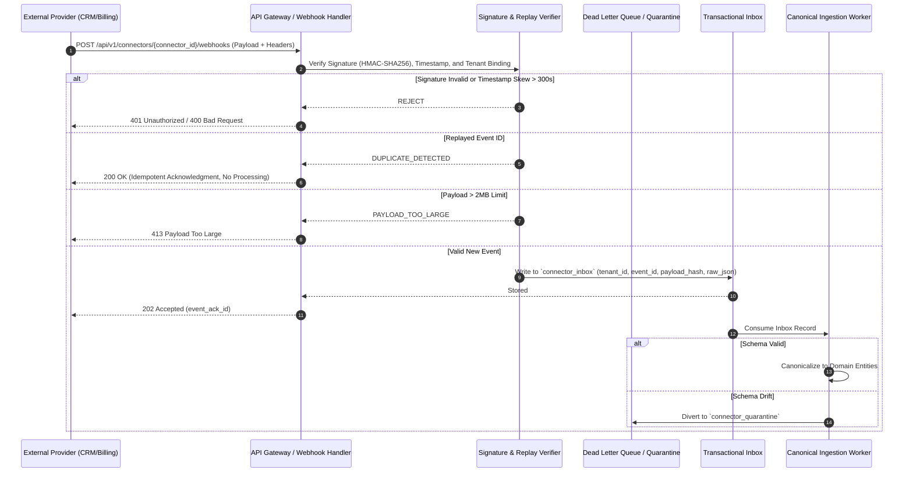

# Connector Platform Specification (Phase 07 Canonical Contract)

Status: Accepted Canonical Specification
Initiative: REVPILOT
Phase: Phase 07 — Multi-Tenant Pilot, Connectors, and Tenant Operations
Rail Alignment: Rail 16 (Connectors & Ingestion), Rail 15 (Action Safety), Rail 17 (Observability/FinOps/Audit)
Owners: Integration Architecture, Security Architecture, Data Platform
Traceability: `BR-004`, `FR-CTL-001`, `FR-CTL-003`, `FR-ACT-001`, `FR-ACT-003`, `INV-SEC-001`, `INV-SEC-002`, `INV-SEC-003`, `INV-TEN-001`, `INV-TEN-002`, `INV-TEN-003`, `INV-DATA-001`, `INV-DATA-002`, `INV-AUD-001`, `INV-AUD-002`, `INV-REL-001`, `INV-REL-002`, `NFR-SEC-001`, `NFR-SEC-002`, `NFR-TEN-001`, `NFR-REL-001`, `NFR-REL-002`, `AC-009`, `AC-010`, `ADR-0005`, `ADR-0007`, `ADR-0009`
Approver: Duong Vinh (Repository Owner)
Version: v1.0
Last Reviewed Date: 2026-09-04

---

## 1. Executive Summary and System Boundaries

This specification defines the architecture, lifecycle state machine, ingestion contracts, credential scoping, webhook verification, schema drift isolation, and reconciliation protocols for RevPilot AI connectors.

### 1.1 Non-Negotiable Connector Invariants
1. `INV-DATA-002` (External Source Authority): External systems (CRMs, billing engines, ticketing portals, ERPs) remain authoritative for source facts. Connectors ingest data into RevPilot's canonical schema, but RevPilot never claims primary ownership over external records.
2. `INV-SEC-001` (Zero Credential Exposure): Connector workers and Agent Runtimes NEVER receive or store raw external provider credentials. All authentication is mediated via opaque, scoped `SecretReference` objects resolved by the `CredentialBroker`.
3. `INV-SEC-003` (Capability Boundary): Connectors are read/sync pipelines. Connectors CANNOT mutate external systems directly. Any outbound mutation or write operation MUST route through the governed Tool Gateway and Approval Loop (`FR-ACT-001`).
4. `INV-TEN-001..002` (Tenant Isolation): Every connector instance, sync job, webhook listener, cursor, and quarantine partition is strictly isolated by server-derived `TenantId`. Cross-tenant sync or cursor leakage equals zero.
5. `INV-REL-001` (Fail Closed on Uncertainty): If connector authentication, rate-limiting status, or schema validity is ambiguous, sync fails closed, isolates raw payloads into quarantine, and halts canonicalization.

---

## 2. Connector Metadata Contract and Schema

Every connector registered in RevPilot conforms to the canonical `ConnectorInstanceRecord`:

```python
class SyncMode(str, Enum):
    BATCH_PULL = "BATCH_PULL"          # Polled incremental pull
    WEBHOOK_PUSH = "WEBHOOK_PUSH"      # Inbound real-time webhook
    CDC_STREAM = "CDC_STREAM"          # Change data capture (conditional on ADR trigger)

class ConnectorStatus(str, Enum):
    REGISTERED = "REGISTERED"
    CONFIGURED = "CONFIGURED"
    VALIDATING = "VALIDATING"
    ACTIVE = "ACTIVE"
    DEGRADED = "DEGRADED"
    PAUSED = "PAUSED"
    AUTH_EXPIRED = "AUTH_EXPIRED"
    SCHEMA_DRIFT = "SCHEMA_DRIFT"
    QUARANTINED = "QUARANTINED"
    RECONCILIATION_REQUIRED = "RECONCILIATION_REQUIRED"
    DELETING = "DELETING"
    DELETED = "DELETED"
    FAILED = "FAILED"

class ConnectorInstanceRecord(BaseModel):
    connector_id: UUIDv7
    tenant_id: TenantId
    provider_name: str                 # e.g. "hubspot", "salesforce", "stripe", "mock_crm"
    provider_version: str              # e.g. "v3"
    capability_type: str               # e.g. "crm_sync", "billing_sync", "ticket_sync"
    auth_method: str                   # "oauth2_code", "oauth2_client_credentials", "api_key_vault"
    secret_ref: SecretReference        # Opaque reference in secret store
    granted_scopes: List[str]          # Exact least-privilege scopes
    data_classification: str           # "INTERNAL", "CONFIDENTIAL", "RESTRICTED"
    sync_mode: SyncMode
    cursor_position: Optional[str]     # Checkpoint token, sequence number, or ISO timestamp
    last_successful_sync_at: Optional[UtcDateTime]
    sync_lag_seconds: int = 0
    schema_version: str = "1.0.0"
    mapping_version: str = "1.0.0"
    status: ConnectorStatus
    rate_limit_per_minute: int
    retry_class: str                   # "standard_backoff", "conservative_provider"
    timeout_seconds: int = 30
    freshness_target_minutes: int = 60
    quarantine_count: int = 0
    created_at: UtcDateTime
    updated_at: UtcDateTime
```

---

## 3. Connector Lifecycle State Machine



### 3.1 Lifecycle Transitions and Behavioral Rules

| Transition | Trigger / Actor | Precondition | State Action & Safety Boundary | Audit Event |
|---|---|---|---|---|
| `REGISTERED` $\to$ `CONFIGURED` | Tenant Admin | Provider manifest exists; valid `SecretReference` created | Validates that secret reference exists in broker; does not reveal secret value | `connector.configured` |
| `CONFIGURED` $\to$ `VALIDATING` | Worker / SRE | Validated scopes match minimal capability manifest | Dispatches read-only canary request to mock/provider endpoint | `connector.validating` |
| `VALIDATING` $\to$ `ACTIVE` | Validator Worker | Canary request 200 OK; permissions verified | Activates scheduled sync worker and webhook receiver | `connector.activated` |
| `ACTIVE` $\to$ `DEGRADED` | Ingestion Worker | Consecutive HTTP 429 or 503 errors $\ge 3$ | Implements exponential backoff with full jitter; slows sync frequency | `connector.degraded` |
| `ACTIVE` $\to$ `AUTH_EXPIRED` | Ingestion Worker | HTTP 401/403 returned by provider | Halts sync immediately; notifies tenant administrator; blocks retries | `connector.auth_expired` |
| `ACTIVE` $\to$ `SCHEMA_DRIFT` | Schema Validator | Payload has missing required fields or type collision | Halts canonical ingestion; diverts unparseable events to quarantine | `connector.schema_drift` |
| `SCHEMA_DRIFT` $\to$ `QUARANTINED`| Ingestion Worker | Automated classification flags breaking drift | Stores raw payload in `connector_quarantine` table with SHA-256 hash | `connector.quarantined` |
| `QUARANTINED` $\to$ `RECONCILIATION_REQUIRED` | Mapping Engine | Operator deploys updated mapping version | Freezes cursor; initiates backfill dry-run | `connector.reconciliation_queued`|
| `RECONCILIATION_REQUIRED` $\to$ `ACTIVE` | Reconciliation Job | 100% quarantined payloads processed or classified | Restores normal polling; advances sync cursor | `connector.reconciled` |
| Any $\to$ `DELETING` $\to$ `DELETED` | Tenant Admin | Verified `tenant_admin` authority | Purges sync state, checkpoints, cursors, and secret references | `connector.deleted` |

---

## 4. Webhook Ingestion, Replay Protection, and Verification Contract

For real-time push integrations, the RevPilot API Gateway exposes hardened webhook endpoints:

`POST /api/v1/connectors/{connector_id}/webhooks`



### 4.1 Webhook Verification Rules
1. **Cryptographic Signature Verification**:
   - Webhook requests MUST include provider signature header (e.g. `X-HubSpot-Signature-v3`, `Stripe-Signature`).
   - Signature is computed via HMAC-SHA256 using the tenant's registered webhook signing secret.
   - Timing attacks are prevented using constant-time string comparison (`hmac.compare_digest`).
2. **Timestamp Tolerance & Anti-Replay**:
   - Webhook timestamp header must be within 300 seconds ($\pm 5$ minutes) of RevPilot server UTC clock.
   - Any request older than 300 seconds is rejected immediately with error `WEBHOOK_TIMESTAMP_OUT_OF_BOUNDS`.
3. **Idempotency & Deduplication**:
   - Every external event ID (`event_id` or `idempotency_key`) is stored in PostgreSQL table `connector_inbox_events` with unique constraint `(tenant_id, connector_id, external_event_id)`.
   - Duplicate events are acknowledged with HTTP 200/202 to satisfy the provider, but processing is skipped.
4. **Out-of-Order Handling**:
   - Ingested entities carry external `event_timestamp`. If an update arrives with `event_timestamp < entity.last_modified_at`, the update is flagged as out-of-order and reconciled via event sourcing rules.

---

## 5. Schema Drift Detection and Quarantine Mechanics

When upstream SaaS providers alter their schemas without notice:

```text
Incoming Payload
      │
      ▼ [Schema Validator]
      Does payload match active `mapping_version`?
      ├── YES ──► Write to Canonical Tables (Customers, Contracts, Orders)
      └── NO  ──► Evaluate Drift Severity:
                    │
                    ├── BENIGN (Additive unknown field)
                    │     └── Ingest known fields, log telemetry `schema.additive_field_ignored`
                    │
                    └── CRITICAL (Missing mandatory field, type collision, mutated metric enum)
                          ├── Quarantine payload in `connector_quarantine`
                          ├── Transition connector to `SCHEMA_DRIFT`
                          ├── Alert Tenant Admin and SRE via Opsgenie/Slack
                          └── Block downstream analytics from consuming corrupted metrics
```

### 5.1 Drift Quarantine Contract
Quarantined records are stored in `connector_quarantine`:
- `quarantine_id`: UUIDv7
- `tenant_id`: TenantId
- `connector_id`: UUIDv7
- `payload_digest`: SHA-256 hash of raw payload
- `raw_payload`: Unaltered JSON
- `error_reason`: Exact structural validation error
- `quarantined_at`: UtcDateTime
- `status`: `PENDING_REVIEW` | `REPROCESSED` | `DISCARDED`

---

## 6. CDC and Event-Driven Platform Trigger Baseline (`ADR-0007`)

In accordance with `ADR-0007-messaging-event-baseline.md`:
1. **Baseline Ingestion**: PostgreSQL Transactional Outbox/Inbox with polling workers is the authoritative architecture for Phase 07 commercial pilots.
2. **CDC / Dedicated Streaming Revisit Trigger**:
   - A dedicated event streaming platform (e.g. Apache Kafka, AWS Kinesis) is NOT deployed in Phase 07.
   - Trigger to revisit: Aggregate event ingestion throughput exceeds 1,000 events/second sustained for $> 1$ hour, or outbox polling latency exceeds 5,000ms under 80% database capacity. Until that condition is met, PostgreSQL-backed outbox remains the canonical message bus.

---

## 7. Forbidden Actions and Safety Constraints
- NO connector may execute mutations on external systems; writes are reserved exclusively for the Tool Gateway (`FR-ACT-001`).
- NO connector may store raw credentials in sync cursors, logs, telemetry, or workflow inputs (`INV-SEC-001`).
- NO connector worker may automatically retry irreversible actions (`INV-ACT-001`).
- NO connector may bypass tenant boundaries or query across multiple tenants (`INV-TEN-001`).
