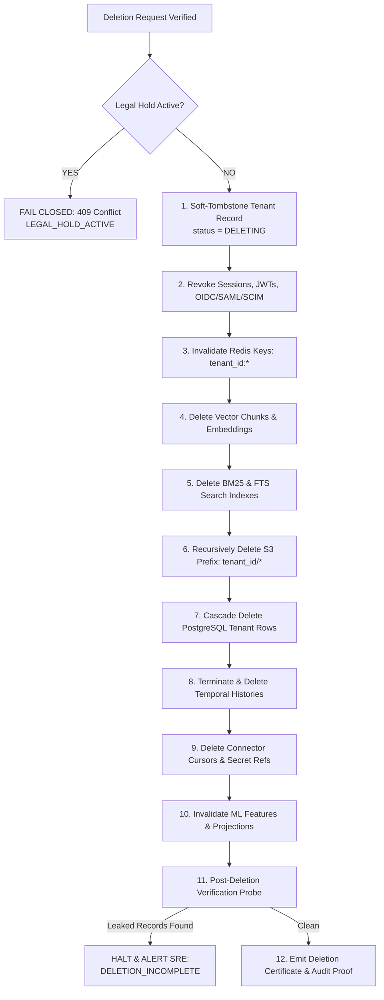

# Data Governance, Privacy, Export, and Deletion Specification (Phase 07 Canonical Contract)

Status: Accepted Canonical Specification
Initiative: REVPILOT
Phase: Phase 07 — Multi-Tenant Pilot, Connectors, and Tenant Operations
Rail Alignment: Rail 2 (Tenant Context & Lifecycle), Rail 5 (Persistence Isolation Foundation), Rail 17 (Observability/FinOps/Audit)
Owners: Data Governance Architecture, Security Architecture, Legal & Compliance
Traceability: `BR-004`, `FR-CTL-001`, `FR-CTL-003`, `INV-DATA-001`, `INV-DATA-002`, `INV-PRV-001`, `INV-AUD-001`, `INV-AUD-002`, `INV-TEN-001`, `INV-TEN-002`, `INV-TEN-003`, `INV-REL-001`, `NFR-PRV-001`, `NFR-PRV-002`, `NFR-TEN-001`, `NFR-AUD-001`, `AC-010`, `ADR-0004`, `ADR-0005`, `ADR-0009`

---

## 1. Executive Summary and Principles

Data governance in RevPilot AI enforces strict purpose limitation, privacy preservation, tenant data ownership, cryptographic integrity, and deterministic deletion propagation across all primary and derived datastores.

### 1.1 Non-Negotiable Data Governance Invariants
1. `INV-DATA-001` (Temporal Anti-Leakage): All analytical queries, feature aggregations, and evidence extraction honor the `:as_of_time` boundary. Backtests, evaluations, and investigations can never consume records timestamped after the evaluation window.
2. `INV-DATA-002` (Authoritative Source Precedence): Primary operational systems remain authoritative. Projections (vector indices, caches, materialized views) are disposable and rebuildable from primary canonical stores.
3. `INV-PRV-001` (Data Minimization & Redaction): Data included in AI contexts, telemetry, and evidence bundles must be purpose-limited. Direct PII (names, emails, phone numbers, payment tokens) is strictly masked or tokenized.
4. `INV-AUD-002` (Audit Minimization): Audit logs record cryptographic digests, policy references, and tenant contexts—never raw prompt dumps, customer secrets, or unmasked PII.
5. `NFR-PRV-002` (Residency & Retention Boundary): Jurisdictional data residency boundaries and legal retention requirements remain flagged as `UNKNOWN` until formalized by legal counsel. Systems implement modular configuration hooks without hardcoding unverified legal mandates.

---

## 2. Data Classification and Field Handling Matrix

Every piece of data ingested, stored, or processed is classified into one of four tiers:

| Tier | Definition | Canonical Examples | Allowed in AI Prompt / Context | Allowed in Operational Logs | Allowed in Audit Trail | Storage & Encryption Standard |
|---|---|---|---|---|---|---|
| **PUBLIC** | Freely shareable product data | Public SLA policy, pricing tiers, API doc schemas | Yes (Unrestricted) | Yes | Yes | Encrypted at rest (AES-256) |
| **INTERNAL** | Tenant operational data | Aggregated ARR, SKU codes, delivery transit times | Yes (Tenant-scoped) | IDs only | Aggregates & IDs | Tenant-partitioned RLS (AES-256) |
| **CONFIDENTIAL** | Sensitive commercial terms | Specific discount terms, contract values, customer volume | Yes (ACL-verified) | No | Hashes & IDs only | Column-level encryption + RLS |
| **RESTRICTED** | High-risk PII / Credentials | Customer names, emails, phone numbers, API keys, tokens | Strictly Prohibited (Must be masked) | Strictly Prohibited | Strictly Prohibited | Tokenized / Isolated Vault / Excluded from LLM |

### 2.1 Automated PII Masking and Redaction Rules
1. **Email Masking**: `john.doe@enterprise.com` $\to$ `j***e@e********.com`
2. **Phone Number Masking**: `+1 (555) 123-4567` $\to$ `+1 (555) ***-**67`
3. **Monetary Specificity Minimization**: When exposed to general agent prompts, monetary values are bucketed or rounded unless the task explicitly requires exact financial calculation (`INV-COST-001`).
4. **Secret Stripping**: A regex and entropy scanner parses all inbound and outbound texts; any pattern matching API keys, JWTs, or private keys is replaced with `[REDACTED_SECRET]`.

---

## 3. Tenant Data Export Contract

Tenants have the sovereign right to export all tenant-owned data in a structured, machine-readable format.

### 3.1 Export Requirements and Constraints
1. **Tenant-Scoped**: The export engine queries strictly within the caller's server-derived `TenantId`. Inclusion of cross-tenant data equals zero (`NFR-TEN-001`).
2. **Authorization Enforcement**: Requires explicit `tenant:export` permission held by an authenticated human administrator. Agents cannot initiate data exports.
3. **Completeness or Explicit Scope**:
   - `FULL_TENANT_EXPORT`: Gathers all relational data, document metadata, ticket intelligence summaries, causal studies, recommendations, and action ledger records.
   - `SCOPED_EXPORT`: Gathers specific domain entities (e.g. `audit_logs_only`, `customers_only`).
4. **Non-Authoritative Nature**: The exported archive is a point-in-time snapshot and does not represent a live authoritative replica.
5. **Integrity Sealing**: The export bundle is packaged as an archive (e.g. `tar.zst`) accompanied by:
   - `manifest.json`: List of all exported files, record counts, schema versions, and generation timestamp.
   - `manifest.sha256`: Cryptographic SHA-256 hash digest signed with RevPilot's platform key.

---

## 4. Tenant Data Deletion and Cascade Purging Contract

When a tenant contract terminates or an authorized "Right to be Forgotten" request is processed:

### 4.1 Deletion State Machine and Cascade Sequence

### 4.2 Handling of Backups and Archives
- **Transactional Backups**: Database backups taken prior to deletion retain historical snapshots until their standard retention period expires.
- **Tombstone Masking**: In the event of a database restore from backup, the restoration pipeline immediately reapplies deletion tombstones from the immutable `tenant_deletion_certificates` ledger before opening the database to traffic.
- **Audit Log Preservation**: Security audit logs retain only the event record `tenancy.data.deletion_completed`, the actor ID, and the SHA-256 completion digest. All customer PII and operational payload records within the audit logs are permanently redacted.

---

## 5. Legal Hold and Regulatory Compliance (`LEGAL_HOLD`)

1. **Precedence Over Deletion**: A legal hold applied by authorized compliance officers immediately suspends all automated and manual deletion routines for that tenant.
2. **Attempted Deletion While Under Hold**: Any deletion workflow targeting a tenant under legal hold fails closed immediately with error `LEGAL_HOLD_ACTIVE` (409) and emits a high-severity security alert.
3. **Release Protocol**: Legal holds can only be released with formal digital signature verification of authorized legal counsel.

---

## 6. Data Lineage and Provenance Tracking

1. **End-to-End Lineage**: Every derived record (e.g. ML churn prediction, causal effect estimate, recommendation, action intent) stores an immutable provenance trace:
   - `source_entity_ids`: List of primary canonical records used as input.
   - `pipeline_version`: Exact code and model version generating the output.
   - `as_of_time`: Snapshot timestamp used for temporal consistency.
2. **Correction and Reprocessing**: If primary data is amended or corrected in the upstream CRM/billing source, the connector ingests the update, flags dependent projections as `STALE`, and queues an asynchronous re-computation pipeline without creating retroactive historical distortion.
