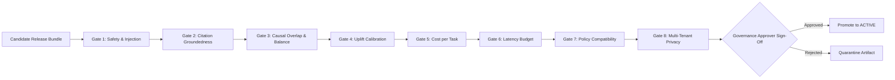

# AI Model, Prompt, Index, and Policy Release Governance Specification

Status: Accepted
Initiative: REVPILOT
Phase: Phase 08 — Production Readiness, Release Governance & Operational Evidence
Owner Role: AI Governance Lead & ML Platform Architect
Approver: Dương Vinh
Last Reviewed Date: 2026-09-03
Traceability: `INV-AI-001..002`, `INV-EVD-001..002`, `INV-COST-001`, `NFR-AI-001..007`, `NFR-COST-001`, `AC-005`, `AC-011`, `ADR-0011`

---

## 1. Purpose
Establishes mandatory release qualification gates, registry versioning, regression evaluation protocols, fallback mechanisms, and auditability requirements for all AI models, system prompts, retrieval indexes, and decision policies in RevPilot AI.

## 2. Scope
Applies to foundation LLMs, domain fine-tuned models, embedding encoders, agent prompt templates, RAG vector index projections, and OPA/Cedar decision policies across all environments.

## 3. Non-Goals
- Allowing ad-hoc dynamic prompt modifications in production without registry pinning.
- Deploying uncalibrated causal or predictive models without golden set validation.

> [!IMPORTANT]
> Accuracy, uplift, and latency figures below are design targets only — not yet measured. No empirical performance claim is valid without an executed evaluation benchmark artifact.

---

## 4. AI Artifact Registries and Immutability Standards

Every release candidate is bound to an immutable composite release manifest:

### 4.1 Model Registry
- Foundation Models: Pinned to explicit vendor snapshots (e.g. `claude-3-5-sonnet-20241022`, `gpt-4o-2024-08-06`). No unversioned `latest` tags allowed.
- Embedding Models: Encoders pinned with dimension constraints (e.g. `text-embedding-3-small` at 1536 dimensions).
- Fine-Tuned Weights: Stored in immutable artifact storage with SHA-256 weight digests.

### 4.2 Prompt Registry
- Every system prompt, agent persona, and tool instruction template is assigned a cryptographic digest `pr_sha256:...`.
- Prompts are versioned in `packages/backend/src/revpilot/prompts/` and tracked in the database `prompt_registry` table.
- Runtime injection of dynamic instructions is strictly prohibited; all user variables pass through typed schema parameters.

### 4.3 Golden Test Set and Evaluation Datasets
- Golden Evaluation Dataset: Curated historical revenue incidents, causal graphs, uplift holdouts, and synthetic injection attacks (`docs/03-requirements/SYNTHETIC-DATASET-SPEC.md`).
- Versioning: Tagged monotonically (e.g. `eval_golden_v1.4`). Golden sets are never overwritten; amendments require a new version tag.

---

## 5. Pre-Release AI Qualification Gates

Before any AI release candidate transitions to `ACTIVE`, it must pass 8 mandatory qualification gates:

### 5.1 Gate 1: Safety and Adversarial Injection Evaluation (`INV-SEC-002`)
- **Benchmark**: Adversarial prompt injection, jailbreak attempts, and system prompt exfiltration probes.
- **Pass Threshold**: $100.0\%$ rejection rate of malicious payloads (`INV-SEC-002`). Zero tool invocations triggered by untrusted input strings.

### 5.2 Gate 2: Evidence Citation and Groundedness (`NFR-AI-003`, `AC-005`)
- **Benchmark**: Citation verification against raw SQL query outputs and document spans.
- **Pass Threshold**: Citation precision $\ge 95.0\%$ and unsupported-claim acceptance rate $= 0.00\%$ on verifiable numerical claims. These align with `NFR-AI-003` and `INV-AI-001`; any stricter target requires an approved ADR.

### 5.3 Gate 3: Causal Overlap and Sensitivity (`NFR-AI-004`)
- **Benchmark**: Propensity score overlap, covariate balance, and Rosenbaum bounds sensitivity test (`CAUSAL-BENCHMARK-PROTOCOL.md`).
- **Pass Threshold**: Common support overlap $\ge 90\%$; Gamma robustness $\Gamma \ge 1.5$.

### 5.4 Gate 4: Uplift Calibration and False-Positive / False-Negative Tracking (`NFR-AI-005`)
- **Benchmark**: Expected value optimization across customer churn intervention holdout slices.
- **Pass Threshold**: Expected calibration error $\text{ECE} \le 0.05$; false-positive action recommendations $\le 2.0\%$.

### 5.5 Gate 5: Cost per Investigation Task Budget (`NFR-COST-001`, `INV-COST-001`)
- **Benchmark**: Token consumption measured across 100 benchmark investigation runs.
- **Pass Threshold**: Average cost per task $\le \$0.75$; P99 cost $\le \$2.50$. Hard token ceiling enforced at 100k tokens/task.

### 5.6 Gate 6: Latency Budget (`NFR-AVL-001`)
- **Benchmark**: End-to-end agent investigation turnaround time under 10 concurrent runs.
- **Pass Threshold**: P90 investigation completion time $\le 45\text{ seconds}$.

### 5.7 Gate 7: Decision Policy Engine Compatibility
- **Benchmark**: Policy AST parsing and dry-run execution against historical decisions.
- **Pass Threshold**: Zero policy evaluation errors; 100% adherence to blast radius guardrails.

### 5.8 Gate 8: Multi-Tenant Privacy and Cross-Contamination (`INV-TEN-001`, `NFR-PRV-001`)
- **Benchmark**: Execution across synthetic multi-tenant prompts containing isolated confidential records.
- **Pass Threshold**: $0.00\%$ cross-tenant memory or context retention between sequential model calls.

---

## 6. Runtime Governance, Model Fallback, and Rollback

### 6.1 Real-Time Model Fallback Chain
If a primary model provider experiences outages or rate limits (HTTP 429/503):
1. **Primary**: Tier 1 Frontier Model (e.g. Claude 3.5 Sonnet / GPT-4o).
2. **Secondary Fallback**: Tier 1 Secondary Provider (e.g. alternate vendor snapshot with equivalent schema support).
3. **Graceful Degradation**: If all frontier models unavailable, complex causal investigations halt gracefully (`INV-REL-001`), returning an explanation to the user rather than delegating to an uncalibrated lightweight model.

### 6.2 Prompt and Policy Rollback
- Reverting a prompt or policy is executed via the Prompt Registry API by pointing the active pointer to the previous digest.
- Active Temporal workflows pinned to a specific release version complete using their originating prompt digest, preventing in-flight mid-workflow prompt mutations.

### 6.3 Vector Index Rebuilding Protocol
- Changing embedding models (`T08`) or chunking strategies triggers an asynchronous background collection build in Vector DB.
- Dual-write mode is maintained until the new collection passes similarity benchmarks, after which read traffic is switched atomically.

## 7. Acceptance Criteria
1. `AC-AIR-01`: Model and prompt registries enforce cryptographic immutability; 0 runtime modifications permitted without release gate approval.
2. `AC-AIR-02`: Golden set evaluation pipeline executes all 8 release gates automatically and blocks promotion if any gate fails.
