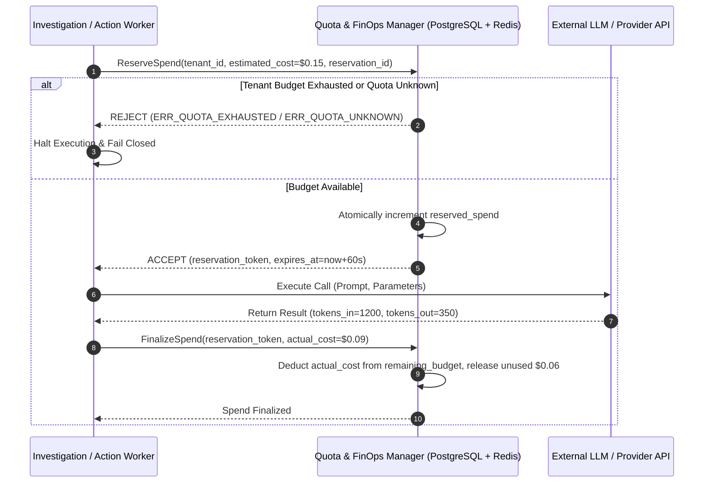

# FinOps, Quotas, and Usage Metering Specification (Phase 07 Canonical Contract)

Status: Accepted Canonical Specification
Initiative: REVPILOT
Phase: Phase 07 — Multi-Tenant Pilot, Connectors, and Tenant Operations
Rail Alignment: Rail 17 (Observability/FinOps/Audit), Rail 2 (Tenant Context & Lifecycle), Rail 14 (Policy and Approval)
Owners: FinOps Architecture, Billing Engineering, Infrastructure Operations
Traceability: `BR-004`, `FR-CTL-002`, `INV-COST-001`, `INV-TEN-001`, `INV-TEN-002`, `INV-AUD-001`, `INV-REL-001`, `NFR-COST-001`, `NFR-COST-002`, `NFR-TEN-001`, `NFR-OBS-002`, `ADR-0001`, `ADR-0005`, `ADR-0009`, `ADR-0011`

---

## 1. Executive Summary and Architectural Principles

This specification defines the multi-tenant quota management system, atomic spend reservations, multi-dimensional usage metering, and provider cost reconciliation for RevPilot AI commercial pilots.

### 1.1 Foundational FinOps Invariants
1. `INV-COST-001` (Atomic Spend Reservation): Before executing any external model inference, tool execution, or downstream action, the system atomically reserves the estimated upper-bound cost from the tenant's budget. Concurrent requests must serialize or reject rather than overspend.
2. `FR-CTL-002` (Multi-Dimensional Attribution): 100% of usage and costs are attributed along the full hierarchy: `Tenant -> Principal -> Investigation -> Workflow -> Agent -> Model/Tool -> External Provider`.
3. `NFR-COST-001` (Zero Unallocated Spend): Over-budget executions are strictly blocked (`FAIL_CLOSED`). Under no circumstances does a tenant exceed their allocated hard spend limit.
4. `NFR-COST-002` (Usage Reconciliation): Daily and monthly usage records are reconciled against external provider invoices, targeting $\ge 99.5\%$ attribution precision.
5. **No Fabricated Financials**: Missing or unreconciled provider costs remain marked as `PROVISIONAL` or `ESTIMATED`. Fabricating costs or reconciliations is structurally prohibited.

---

## 2. Multi-Tenant Quota System

Every tenant is bound to an active `TenantQuotaPolicy` governing throughput, concurrency, storage, and spend:

### 2.1 Quota Dimensions Matrix

| Dimension | Scope | Enforcement Point | Throttling / Policy Action | Default Pilot Limit |
|---|---|---|---|---|
| **API Request Rate** | Requests / sec | API Gateway Middleware | HTTP 429 Too Many Requests | 50 req/sec |
| **Event Ingestion Rate** | Events / min | Webhook & Ingestion Pipeline | Ingestion backpressure / HTTP 429 | 1,000 events/min |
| **Connector Sync Rate** | Runs / hour | Connector Scheduler | Defer sync execution | 4 syncs/hour |
| **Relational Storage** | Megabytes | Database Manager | Block file uploads / warn admin | 50 GB |
| **Vector Storage** | Embedding Chunks | RAG Ingestion Pipeline | Reject new document indexing | 100,000 chunks |
| **Workflow Concurrency** | Active Workflows | Temporal Client Boundary | Queue workflow execution | 5 concurrent |
| **Investigation Concurrency** | Active Investigations | Agent Platform Gateway | Queue investigation | 2 concurrent |
| **Model Token Budget** | Tokens / day | AI Provider Adapter | Block model calls / fail closed | 5,000,000 tokens/day |
| **Investigation Model Spend** | USD / investigation | Agent Reasoning Loop | Terminate investigation DAG | \$2.00 target / \$5.00 hard stop |
| **Tool Execution Concurrency** | Concurrent Tool Calls | Tool Gateway | Queue tool dispatch | 10 concurrent |
| **Action Attempt Budget** | Actions / day | Approval & Dispatch Engine | Block action dispatch | 20 actions/day |
| **Export Bundle Size** | MB / export | Export Worker | Reject oversized export | 5 GB |
| **Active User Sessions** | Concurrent Logins | IAM Session Manager | Reject new login (or bump oldest)| 25 sessions |

### 2.2 Quota Reservation and Release Lifecycle



### 2.3 Quota Race Conditions and Backpressure
- Atomic reservations execute via PostgreSQL row-level locks (`SELECT ... FOR UPDATE`) or Redis Lua scripts.
- When a quota limit is approached ($\ge 80\%$), an alert event `finops.quota.warning` is emitted.
- If a race condition occurs where two requests attempt to reserve the final remaining budget, one succeeds and the other receives `ERR_QUOTA_EXHAUSTED` (429/402). Over-allocation is physically prevented.

---

## 3. Multi-Dimensional Usage Metering Contract

Every billable or metered interaction generates an immutable `UsageRecord`:

```python
class MeteringUnit(str, Enum):
    TOKENS = "tokens"
    CALLS = "calls"
    SECONDS = "seconds"
    BYTES = "bytes"
    ACTIONS = "actions"

class ReconciliationStatus(str, Enum):
    ESTIMATED = "ESTIMATED"
    CONFIRMED = "CONFIRMED"
    RECONCILED = "RECONCILED"
    DISCREPANCY = "DISCREPANCY"

class UsageRecord(BaseModel):
    usage_id: UUIDv7
    tenant_id: TenantId
    principal_id: PrincipalId
    investigation_id: Optional[UUIDv7]
    workflow_id: Optional[str]
    agent_name: Optional[str]
    model_or_tool_name: str           # e.g. "claude-3-5-sonnet", "sql_catalog_query"
    connector_id: Optional[UUIDv7]
    unit: MeteringUnit
    quantity: Decimal                  # e.g. 1550 tokens or 1.25 seconds
    estimated_provider_cost_usd: Decimal
    currency: str = "USD"
    reconciliation_status: ReconciliationStatus
    idempotency_key: str              # Unique hash preventing duplicate billing
    recorded_at: UtcDateTime
```

---

## 4. Provider Cost Reconciliation Protocol

1. **Daily Ingestion**: Ingests automated billing reports / usage CSVs from cloud and model providers (e.g. Anthropic, OpenAI, AWS).
2. **Deterministic Matching**: Correlates provider request IDs and timestamps against RevPilot `UsageRecord` entries using `idempotency_key`.
3. **Variance Tracking**:
   - If $|\text{Actual Cost} - \text{Estimated Cost}| \le 2\%$: Status updated to `RECONCILED`.
   - If $|\text{Actual Cost} - \text{Estimated Cost}| > 2\%$: Status updated to `DISCREPANCY`, flagging FinOps review.
4. **Audit Immutability**: Historical `UsageRecord` rows are append-only. Corrections are recorded via adjustment records (`UsageAdjustmentRecord`), never by mutating past records.

---

## 5. Production Financial State Lifecycle and Multi-Cloud Ledger Controls

### 5.1 The 5 Distinct Financial States
To prevent financial ambiguity, every cost record progresses through 5 strictly separated stages:
1. `USAGE_MEASURED`: Raw, unpriced consumption count (tokens, CPU seconds, bytes transferred, API calls) emitted by runtime meters.
2. `USAGE_ESTIMATED`: Initial cost approximation calculated using configured price cards for pre-authorization and atomic budget reservations.
3. `PRICE_CONFIGURED`: Contractual rate card applied per tenant subscription tier and committed-use discounts.
4. `INVOICE_GENERATED`: Draft or provisional billing statement aggregated from finalized usage records at billing cycle close.
5. `INVOICE_RECONCILED`: Finalized settlement after matching provider invoices and resolving variances.

### 5.2 Alert Thresholds and Automated Circuit Breakers
- 50% Budget Utilization: Informational notification in tenant admin dashboard.
- 80% Budget Utilization: Warning webhook emitted to customer billing contact.
- 95% Budget Utilization: High-priority alert; automated throttling of non-critical background sync tasks.
- 100% Budget Utilization: Hard stop (`INV-COST-001`). All additional model reasoning and tool dispatches fail closed with HTTP 402 Payment Required.
