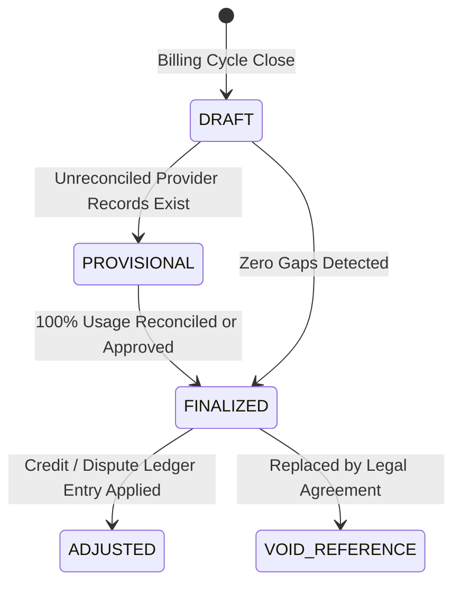

# Billing, Invoicing, and Commercial Entitlement Specification (Phase 07 Canonical Contract)

Status: Accepted Canonical Specification
Initiative: REVPILOT
Phase: Phase 07 — Multi-Tenant Pilot, Connectors, and Tenant Operations
Rail Alignment: Rail 17 (Observability/FinOps/Audit), Rail 2 (Tenant Context & Lifecycle)
Owners: Billing Architecture, FinOps Architecture
Traceability: `BR-004`, `INV-COST-001`, `INV-TEN-001`, `INV-AUD-001`, `NFR-COST-002`, `ADR-0001`, `ADR-0005`

---

## 1. Executive Summary and Principles

This specification governs commercial plans, subscription tiers, entitlement lifecycles, and invoice generation for RevPilot AI commercial pilots. It establishes strict separation between internal operational cost accounting (COGS / FinOps) and commercial customer billing.

### 1.1 Non-Negotiable Billing Invariants
1. **Separation of COGS and Billing**: Raw infrastructure/provider cost is an internal accounting fact owned by FinOps (`FINOPS-SPEC.md`). Commercial billing derives from agreed contractual rates, platform base fees, and billable unit tiers.
2. **Append-Only Ledger**: The billing ledger is immutable. Adjustments, credits, or fee waivers are recorded as append-only credit ledger entries (`BillingAdjustmentRecord`), never by mutating historical line items.
3. **No Raw Payment Card Storage**: RevPilot stores zero credit card Primary Account Numbers (PANs), CVVs, or bank account credentials. Commercial pilot billing uses invoicing / purchase orders.
4. **Provisional Invoicing on Gaps**: If usage data is incomplete or undergoing reconciliation, generated invoices are marked `PROVISIONAL`. Gaps do not result in estimated overcharges.

---

## 2. Commercial Pilot Subscription Tiers and Entitlements

| Plan Name | Isolation Tier | Included Model Tokens | Max Connectors | SLA Target | Support Tier |
|---|---|---|---|---|---|
| **Pilot Standard** | Shared (PostgreSQL RLS) | 20M tokens / month | 2 Active (Mocks/Pilot) | 99.0% | Standard Business Hours |
| **Pilot Enterprise** | Dedicated Schema / Pool | 100M tokens / month | 5 Active | 99.5% | 24/7 Severity 1 Support |
| **Regulated Pilot** | Dedicated DB Cluster | Custom contract | Dedicated VPC | 99.9% | Dedicated TAM & SRE |

### 2.1 Entitlement State Machine
- `PROVISIONED`: Tenant initialized with default free/trial entitlements.
- `ACTIVE`: Active commercial agreement signed and active.
- `PAST_DUE`: Invoiced payment pending; grace period active (14 days). Ingress continues, warnings displayed.
- `RESTRICTED`: Billing hold applied. Write operations and external dispatches disabled; read access preserved.
- `CANCELLED`: Terminal state. Triggers transition to tenant offboarding and data retention countdown.

---

## 3. Invoice Lifecycle and Draft-to-Finalized Pipeline

1. **DRAFT**: Aggregates `UsageRecord` rows across the billing window $[T_{\text{start}}, T_{\text{end}})$.
2. **PROVISIONAL**: Flagged if provider reconciliation is $< 99.5\%$. Customer is notified of pending finalization.
3. **FINALIZED**: Cryptographically sealed with SHA-256 digest. Sent to customer billing contact.
4. **ADJUSTED**: Retroactive corrections applied strictly through offset credit records.

---

## 4. Production Billing Controls, Dispute Resolution, and Ledger Auditability

### 4.1 Dispute and Credit Note Protocol
1. If a customer disputes a metered charge (e.g. agent loop anomaly or duplicate connector sync):
   - Finance operator issues an immutable `CreditNoteRecord` referencing the disputed `InvoiceId` and `UsageRecordId`.
   - The original invoice line items are NEVER modified or deleted.
   - The credit note offsets future invoice cycles or processes an external bank refund.

### 4.2 Financial Ledger Audit Integrity
- Invoices, credit notes, and payment receipts are stored in an append-only PostgreSQL table with SHA-256 block hash chaining (`INV-AUD-001`).
- Daily automated reconciliation jobs compare the billing ledger against external bank / ERP deposits and FinOps provider expense records.
- Variance $> 0.1\%$ triggers a P2 FinOps alert and halts automatic invoice dispatch until manually approved.
