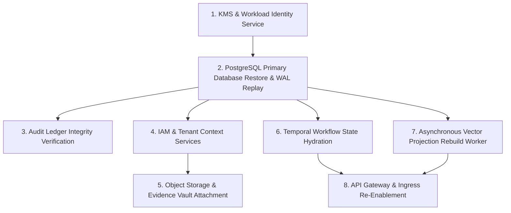

# Disaster Recovery Plan and Comprehensive Failure Scenario Specification

Status: Accepted
Initiative: REVPILOT
Phase: Phase 08 — Production Readiness, Release Governance & Operational Evidence
Owner Role: SRE Lead & Storage Architect
Approver: Dương Vinh
Last Reviewed Date: 2026-09-03
Traceability: `BR-004`, `INV-DATA-001..002`, `INV-TEN-001..003`, `INV-REL-001..002`, `NFR-REC-001`, `NFR-DUR-001`, `NFR-AVL-001`, `ADR-0004`, `ADR-0005`, `ADR-0008`

---

## 1. Disaster Recovery Objectives and Targets

> [!IMPORTANT]
> Design targets only — not yet measured in production. Targets are established as architecture invariants and must be validated through scheduled recovery rehearsals (`CTL-DR-01`).

1. **Recovery Point Objective (RPO)**: $\le 5\text{ minutes}$ via continuous WAL streaming to cross-region object storage.
2. **Recovery Time Objective (RTO)**: $\le 30\text{ minutes}$ via automated infrastructure-as-code deployment, snapshot restoration, and continuous log replay.
3. **Fail-Closed Principle (`INV-REL-001`)**: If disaster recovery cannot guarantee data integrity or tenant isolation, the system defaults to safe degradation, rejecting external mutations.

---

## 2. Subsystem Backup Scope and Restoration Dependency Graph

### 2.1 Subsystems Subject to Backup
- **PostgreSQL Primary Database**: Base snapshots daily + continuous WAL streaming. Contains tenant registries, users, permissions, core business entities, connector configs, and tool execution ledgers.
- **Audit Ledger Store**: WORM-compliant storage with unbroken SHA-256 hash chains.
- **Evidence Blob Storage**: S3-compatible versioned buckets holding investigation artifacts, export bundles, and raw connector snapshots.
- **Configuration & Secrets Vault**: Infrastructure-as-code manifests and KMS master key references.

### 2.2 Subsystems Explicitly EXCLUDED from Backup (Disposable Projections)
- **Vector Database (Qdrant / PgVector)**: Embeddings and RAG indexes are disposable projections; rebuilt deterministically from primary source documents (`INV-DATA-002`).
- **Redis Cache & Session Store**: Volatile in-memory cache; reconstructed on cold start.
- **Worker Queues**: Ephemeral task buffers; durable task state resides in Temporal history and outbox tables.

### 2.3 Restoration Dependency Order
Restoration must strictly follow the subsystem dependency graph to prevent race conditions or data corruption:

---

## 3. Comprehensive Failure Scenario Catalog

### 3.1 Scenario 1: Primary Database Unavailable / Hardware Failure
- **Trigger**: Database node crash, persistent EBS volume failure, unrecoverable read-write socket drop.
- **Failover Procedure**: Automated multi-AZ failover promotes hot standby replica within 60 seconds.
- **Integrity Validation**: Verify replication lag $= 0$; re-validate RLS policies across tenant schemas.
- **Degradation State**: In-flight transactions retry with exponential backoff (max 3 times).

### 3.2 Scenario 2: Object Storage Unavailable / Corrupted
- **Trigger**: Cloud bucket service outage or regional API partition.
- **Recovery Procedure**: Switch evidence read endpoints to secondary cross-region replicated bucket.
- **Degradation State**: New investigation document uploads buffer locally in encrypted worker disk cache; non-blocking retrieval continues.

### 3.3 Scenario 3: Task Queue / Message Broker Unavailable
- **Trigger**: Temporal cluster crash or RabbitMQ/Redis queue partition.
- **Recovery Procedure**: Temporal workers pause task polling and reconnect with jittered backoff.
- **Degradation State**: Inbound webhooks persist to database transactional inbox (`TASK-P07-006`); background sync tasks pause until queue recovers.

### 3.4 Scenario 4: Identity Provider (OIDC / SAML) Unavailable
- **Trigger**: Okta, Entra ID, or Google Workspace global outage.
- **Recovery Procedure**: Fail open for active valid sessions (up to JWT expiry); fail closed for new login requests.
- **Degradation State**: Return clean user-facing error explaining SSO provider outage; block password-based workarounds (`INV-IAM-001`).

### 3.5 Scenario 5: External SaaS Connector Provider Unavailable
- **Trigger**: Salesforce, HubSpot, or Stripe API returns sustained 500/503 errors.
- **Recovery Procedure**: Connector transitions to `DEGRADED` state (`TASK-P07-005`). Sync scheduler applies exponential backoff up to 2 hours.
- **Degradation State**: Core investigation engine relies on historical cached snapshot with clear data freshness disclaimer.

### 3.6 Scenario 6: AI Model Provider API Outage
- **Trigger**: Anthropic or OpenAI API returning 500/503 or sustained rate limit 429.
- **Recovery Procedure**: Automated fallback chain routes request to secondary approved foundation model snapshot (`MODEL-RELEASE-PROCESS.md` §6.1).
- **Degradation State**: If secondary model unavailable, complex causal investigations halt gracefully, notifying user without emitting ungrounded hallucinations.

### 3.7 Scenario 7: Full Cloud Region Outage
- **Trigger**: Entire primary data center region network or power failure.
- **Recovery Procedure**:
  1. SRE Incident Commander authorizes secondary region activation.
  2. Terraform deploys container workloads in target secondary region.
  3. PostgreSQL restores from cross-region WAL stream to $T_{\text{fail}} - 5\text{min}$.
  4. DNS routing redirects public ingress traffic to secondary load balancers.
- **Target SLA**: RPO $\le 5$m, RTO $\le 30$m.

### 3.8 Scenario 8: Data Corruption via Software Bug
- **Trigger**: Unchecked application bug writes invalid calculations across tenant records.
- **Recovery Procedure**:
  1. Trigger immediate kill-switch halting worker ingestion.
  2. Execute Point-in-Time Recovery (PITR) restoring state to timestamp immediately preceding buggy release.
  3. Deploy patched application binary.
  4. Re-run data reconciliation worker.

### 3.9 Scenario 9: Invalid Database Migration
- **Trigger**: Migration script locks critical tables, fails mid-execution, or introduces schema incompatibility.
- **Recovery Procedure**:
  - Because all migrations follow Expand/Contract rules, the previous binary version continues running against the expanded schema.
  - SRE executes migration rollback script to drop non-breaking auxiliary columns in an isolated window.

### 3.10 Scenario 10: Secret Key Rotation Failure
- **Trigger**: Master KMS key revoked prematurely or dual-version rotation handshake fails.
- **Recovery Procedure**:
  - Secret Broker falls back to secondary active version (`TASK-P07-004`).
  - If both versions compromised, all external tool dispatches immediately fail closed (`INV-REL-001`).
  - SRE re-provisions new root key via emergency out-of-band KMS console.

### 3.11 Scenario 11: Audit Pipeline Failure
- **Trigger**: Audit disk volume fills, or audit ingestion worker crashes.
- **Recovery Procedure**:
  - Invariant `INV-AUD-001` mandates 100% unsampled audit logging.
  - Tool Gateway halts all mutating dispatches (HTTP 503 Service Unavailable) until audit pipeline resumes.
  - Zero actions may execute without audit capture.

---

## 4. Disaster Recovery Exercise Cadence and Exit Criteria

To guarantee disaster readiness without conflating operational validation levels, the platform enforces four distinct cadences categorized by purpose:

1. **Tier 1 — Weekly Automated Backup Validation** (`BACKUP-RESTORE-VALIDATION-RUNBOOK.md` §6): Automated cron tests database snapshot hydration and verifies table integrity in an isolated sandbox environment without human intervention.
2. **Tier 2 — Monthly Ephemeral Restore Rehearsal**: Scheduled operator-led rehearsal testing snapshot hydration, WAL replay continuity, and tenant isolation probes.
3. **Tier 3 — Quarterly Formal DR Cold Restore Drill & PITR** (`BACKUP-RESTORE-EXERCISE-RECORD.md`, `DEFINITION-OF-DONE.md:57`): Comprehensive cold restore exercise into isolated staging target validating measured RPO $\le 5$ minutes and RTO $\le 30$ minutes to satisfy DoD Stage D.
4. **Tier 4 — Bi-Annual Full-Scale DR Simulation**: Complete simulated regional failover drill in staging environment with synthetic tenant load and DNS traffic redirection.
5. **Pass Criteria**: Empirical measured RPO $\le 5$ minutes, RTO $\le 30$ minutes, zero cross-tenant leakage, 100% hash chain integrity.
