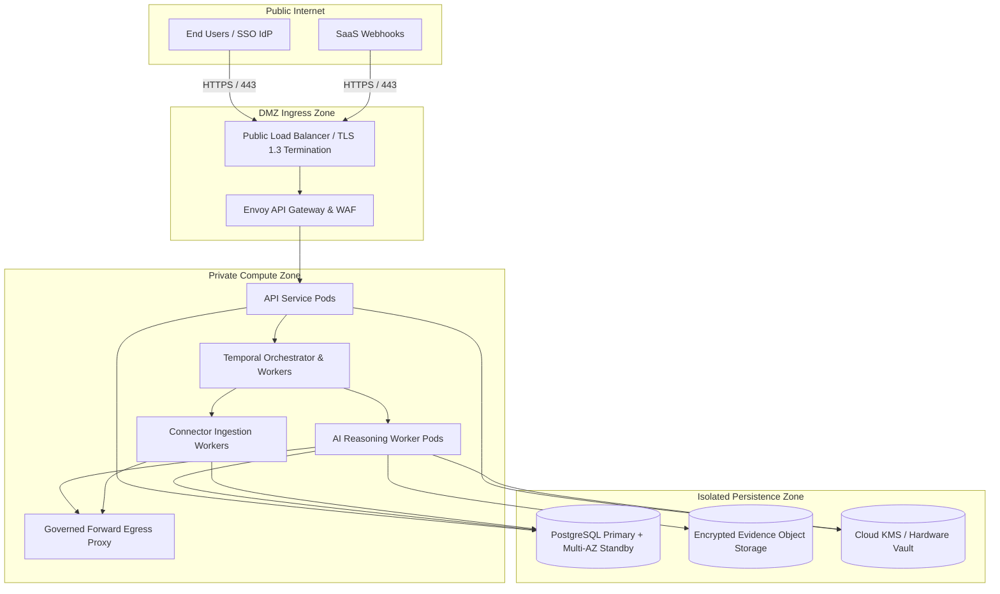

# Production Deployment Architecture and Infrastructure Topology

Status: Accepted
Initiative: REVPILOT
Phase: Phase 08 — Production Readiness, Release Governance & Operational Evidence
Owner Role: Principal Platform Architect & SRE Lead
Approver: Dương Vinh
Last Reviewed Date: 2026-09-03
Traceability: `ADR-0008`, `ADR-0009`, `INV-SEC-001..003`, `INV-REL-001`, `NFR-AVL-001`, `NFR-REC-001`
Version: v1.0

---

## 1. Purpose
Defines the target production deployment topology, containerized compute architecture, network zoning, egress security boundaries, and provider-neutral infrastructure requirements for RevPilot AI.

## 2. Scope
Applies to staging, pilot, and commercial production infrastructure hosting API gateways, orchestration engines, worker nodes, and persistence tiers.

## 3. Non-Goals
- Committing to a specific proprietary cloud vendor (AWS vs GCP vs Azure) prior to commercial review.
- Deploying unmanaged, self-hosted relational databases or homegrown cryptographic key management.

---

## 4. Architectural Principles and Open Decisions

> [!IMPORTANT]
> The target public cloud provider and hosting region remain explicitly `UNKNOWN` per `ADR-0008` pending commercial vendor negotiations. All infrastructure definitions are authored in a provider-neutral manner (Open Container Initiative, Kubernetes / Managed Containers, PostgreSQL wire protocol, S3-compatible object API).

1. **Provider-Neutral Managed Services**:
   - Compute: OCI-compliant container orchestration (Kubernetes or Cloud-Managed Container Apps).
   - Relational Storage: Managed PostgreSQL (v16+) with automated Multi-AZ replication.
   - Object Storage: S3-compatible versioned blob store with cross-region bucket replication.
   - Secret & Key Store: Cloud Key Management Service (KMS) with hardware security module (HSM) backing (`ADR-0009`).
2. **Immutability and Infrastructure-as-Code (IaC)**:
   - 100% of network topology, security groups, and container definitions managed via versioned Terraform / OpenTofu.
   - Manual SSH access to production containers or direct database access is blocked by architecture design.

---

## 5. Network Zoning and Defense-in-Depth Topology

The production deployment enforces strict network partitioning into three isolated security zones:

### 5.1 Zone 1: DMZ Ingress Zone
- Public-facing Network Load Balancer terminates TLS 1.3 (strictly disabling SSLv3, TLS 1.0, 1.1, 1.2).
- Envoy Gateway performs rate limiting, WAF inspection, header sanitization, and request routing.
- Direct external traffic to internal microservices is blocked by security groups.

### 5.2 Zone 2: Private Compute Zone
- Dedicated subnets without public IPv4 addresses.
- Pods interact internally over mutual TLS (mTLS) with short-lived workload certificates.
- **Governed Egress Proxy**: All outbound internet traffic (e.g. calling model providers or SaaS APIs) must route through an authenticated forward egress proxy enforcing a strict DNS allowlist and logging all external socket calls (`INV-SEC-003`).

### 5.3 Zone 3: Isolated Persistence Zone
- Isolated subnets accessible strictly from the Private Compute Zone.
- Relational database and object storage require encrypted connections (`sslmode=verify-full`).
- Zero direct routing from Ingress DMZ to Persistence Zone.

---

## 6. Container Packaging and Workload Profiles

All container images are built from minimal distroless base images, scanned for vulnerabilities (`TC-SEC-SCAN-001`), and pinned to immutable digests (`T01`):

| Workload Name | Component Type | Scaling Profile | Resource Request (Min) | Resource Limit (Max) | Health Probes |
|---|---|---|---|---|---|
| `revpilot-api` | Stateless HTTP | Horizontal Auto (2..20 pods) | 1 CPU, 2 GB RAM | 4 CPU, 8 GB RAM | `/health/live`, `/health/ready` |
| `revpilot-temporal` | Workflow Engine | Horizontal (3 replicas) | 2 CPU, 4 GB RAM | 8 CPU, 16 GB RAM | gRPC Health Probe |
| `revpilot-agent-worker`| Async AI Reasoning| Horizontal Auto (2..50 pods) | 2 CPU, 8 GB RAM | 8 CPU, 32 GB RAM | Heartbeat to Temporal |
| `revpilot-ingestion` | Event & Sync Worker | Partition-based (2..10 pods) | 1 CPU, 4 GB RAM | 4 CPU, 16 GB RAM | Kafka/Queue consumer lag probe |
| `revpilot-finops` | Metering Aggregator | High-availability pair (2 pods) | 1 CPU, 2 GB RAM | 2 CPU, 4 GB RAM | Checkpoint heartbeat probe |

---

## 7. Acceptance Criteria
1. `AC-DEP-01`: Deployment topology strictly blocks direct public routing to compute and persistence tiers.
2. `AC-DEP-02`: 100% outbound external API connections are routed through the governed forward egress proxy.
