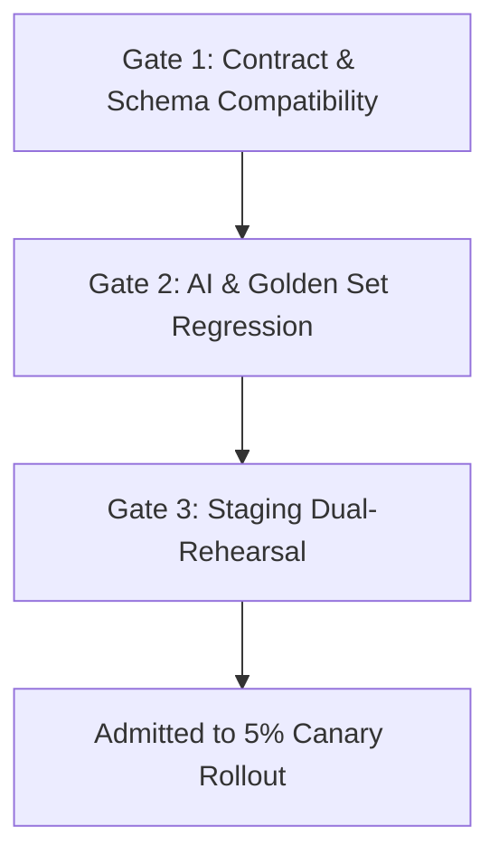

# Multi-Tier Release Governance, Canary Rollout, and Rollback Specification

Status: Accepted
Initiative: REVPILOT
Phase: Phase 08 — Production Readiness, Release Governance & Operational Evidence
Owner Role: Release Lead & Principal Platform Architect
Approver: Dương Vinh
Last Reviewed Date: 2026-09-03
Traceability: `ADR-0008`, `ADR-0009`, `ADR-0011`, `INV-REL-001`, `INV-REL-002`, `INV-DATA-001`, `NFR-AVL-001`, `NFR-AI-001`
Version: v1.0

---

## 1. Purpose
Establishes the governance, canary deployment, progressive rollout, and holistic rollback protocols across all 13 software and configuration artifact tiers of RevPilot AI. Prevents uncoordinated binary deployments from corrupting persistent state, vector projections, or running Temporal workflows.

## 2. Scope
Applies to every release artifact deployed into staging, pilot, and commercial production environments.

## 3. Non-Goals
- Performing uncontrolled hotfixes directly in production containers.
- Reverting database schemas by dropping columns without deprecation cycles.
- Mutating historical workflow execution histories during workflow version upgrades.

## 4. Normative Requirements
1. Every release bundle must explicitly enumerate version identifiers for all 13 artifact dimensions.
2. Deployments must use an Expand/Contract migration strategy for persistent state.
3. Automated rollback triggers must monitor Canary SLO error budget burn rates continuously.
4. Rollback must coordinate across data, AI, policy, and workflow layers simultaneously.

---

## 5. The 13 Versioned Release Artifact Tiers

| Tier | Artifact Type | Version Format | Storage / Registry Location | Mutability Rule |
|---|---|---|---|---|
| **T01** | Application Binary | OCI Image digest (`sha256:...`) | Container Registry | Immutable |
| **T02** | API Contract | Semantic version (`v1.2.0`) + OpenAPI spec | `packages/api/contracts/` | Backward-compatible within major |
| **T03** | Database Schema | Monotonic migration ID (`20260903_v08`) | PostgreSQL `schema_migrations` | Expand/Contract only (Never drop in Expand) |
| **T04** | Workflow Definition | Temporal Workflow Type + Task Queue tag | Temporal Cluster Registry | Backward-compatible replay history |
| **T05** | Connector Adapter | Provider name + Semantic version | Ingestion worker bundle | Version-pinned per connector instance |
| **T06** | Prompt Template | Digest hash (`pr_sha256:...`) | Prompt Registry | Immutable |
| **T07** | Foundation Model | Model identifier + Provider snapshot | Model Registry (`docs/20-evaluation`) | Pinned to explicit provider snapshot |
| **T08** | Embedding Model | Model ID + Vector dimension size | Vector Registry | Change triggers background index rebuild |
| **T09** | Vector Index Projection| Projection version (`vec_v2_1536d`) | Qdrant / PgVector Collection | Dual-write during migration |
| **T10** | Retrieval Config | Top-K, similarity metric, fusion params | RAG Config Store | Immutable per evaluation candidate |
| **T11** | Governance Policy | OPA / Cedar policy AST digest | Policy Engine Store | Versioned append-only audit trail |
| **T12** | Feature Flag Manifest| Evaluated release flag changeset | LaunchDarkly / Unleash manifest | Boolean/percentage rollout matrix |
| **T13** | Tenant Configuration | Tenant tier entitlement schema version | `tenant_operations_config` | Validated by schema validator |

---

## 6. Pre-Deployment Qualification and Release Gates

Before an artifact bundle is admitted to Canary deployment, it must pass three sequential qualification gates:



### 6.1 Gate 1: Contract and Schema Expand/Contract Validation
1. **Expand Phase**: New columns, tables, and endpoints added. All new columns must be `NULLABLE` or have defaults.
2. **Compatibility Verification**: Old application binaries must run against the expanded schema without errors.
3. **Contract Test**: Backward-compatibility regression suite (`pytest tests/contract/`) must pass 100%.

### 6.2 Gate 2: AI Model and Prompt Governance Check
1. Prompt and model hashes must match entries in the approved Model Release Record (`MODEL-RELEASE-PROCESS.md`).
2. Golden set regression evaluation must show zero degradation on core metrics (calibration, safety, citation accuracy).

### 6.3 Gate 3: Staging Dual-Rehearsal
1. Release bundle deployed to staging environment.
2. Automated health probe, tenant isolation matrix, and simulated rollback executed and verified.

---

## 7. Progressive Canary Deployment Protocol

Canary rollout targets an internal synthetic cohort followed by opt-in pilot cohorts:

```
[Phase 1: Canary 5%]  -->  [Observation Window 60m]  -->  [Phase 2: Canary 25%]  -->  [Observation 120m]  -->  [Phase 3: 100% General]
```

### 7.1 Automated Rollback Triggers
The canary deployment automatically aborts and initiates rollback if any of the following occur within the observation window:
1. **HTTP 5xx Spike**: Error rate on canary instances exceeds $0.5\%$ over 5 minutes.
2. **P95 Latency Degradation**: Canary latency increases by $> 25\%$ compared to baseline.
3. **Workflow Crash Loop**: Temporal worker panics or unhandled task failures $> 0$.
4. **Tenant Isolation Breach**: Any RLS violation alarm fires ($> 0$ tolerance).
5. **Cost Anomaly**: Token consumption or model invocation cost exceeds $150\%$ of predicted budget.

---

## 8. Multi-Tier Rollback Procedures

> [!CAUTION]
> Rollback is NEVER merely redeploying the old container binary. A partial binary rollback against an active schema, altered prompt, or mutated vector index can cause severe state corruption or workflow panic.

### 8.1 Rollback Dependency Execution Sequence
When an automated or manual rollback is triggered, steps must execute in exact dependency order:

1. **Step 1 — Ingress Shift (Immediate, $< 30$s)**:
   - Traffic routing proxy shifts 100% of user and webhook traffic back to stable baseline instances.
   - Canary instances isolated into quarantine for forensic analysis.
2. **Step 2 — Feature Flag & Policy Kill-Switch ($< 60$s)**:
   - Toggle all newly introduced feature flags (`T12`) to `OFF`.
   - Revert policy AST digest (`T11`) to previous stable checksum.
3. **Step 3 — Workflow & Worker Drainage ($< 120$s)**:
   - Stop dispatching new workflows to updated task queues (`T04`).
   - Allow in-flight non-blocking tasks to drain; pause mutating actions.
4. **Step 4 — AI & Prompt Reversion ($< 60$s)**:
   - Re-point Agent Orchestrator to previous prompt template (`T06`) and model snapshot (`T07`).
5. **Step 5 — Vector Index Dual-Write Termination ($< 300$s)**:
   - If a new index projection (`T09`) was being populated, suspend reads from it and fall back to stable collection.
6. **Step 6 — Database Schema Contract Recovery**:
   - Because migrations follow Expand/Contract rules, the expanded schema remains compatible with the restored application binary.
   - Defer cleanup (dropping unneeded columns) to an isolated maintenance window. DO NOT run reverse migrations that drop columns during active incident rollback.

---

## 9. Post-Rollback Quarantine and Incident Linkage
1. **Container Quarantine**: Canary containers are stopped but their root filesystems and core dumps are preserved for root-cause analysis (RCA).
2. **Incident Creation**: A P1 incident ticket is automatically spawned linking all canary telemetry, error traces, and commit SHAs.
3. **Blacklist Flag**: The failed release artifact bundle ID is marked `QUARANTINED` in the Release Registry, preventing re-deployment until cleared by SRE Lead.

## 10. Acceptance Criteria
1. `AC-REL-01`: Expand/Contract schema validation script blocks any migration attempting destructive DDL (`DROP COLUMN`, `ALTER COLUMN TYPE`) without a prior deprecation release.
2. `AC-REL-02`: Simulated canary rollback drill restores 100% stable baseline routing within 60 seconds of trigger.
