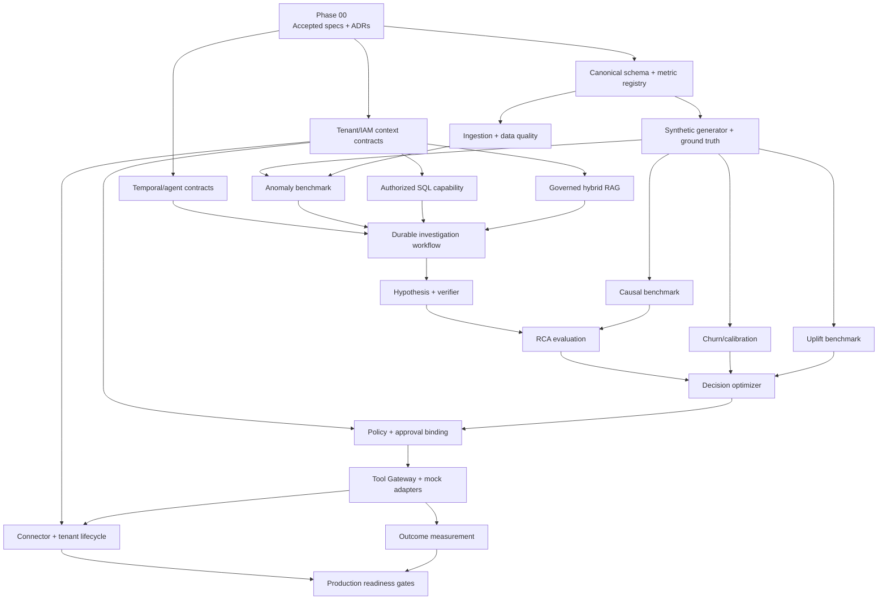

# Implementation Dependency Graph

Status: Proposed v0.1

This file describes phase/feature dependencies. It is not an executor queue. The normative rail gates are in `execution/MICRO-TASK-RAIL-SYSTEM.md`; machine-readable planning edges are in `execution/task-graph.json`. Only one-file MICRO-TASKS explicitly listed in `execution/EXECUTOR-QUEUE.md` may be executed.

Active execution node: `TASK-BOOTSTRAP-001` (Stage-B source/toolchain bootstrap under Phase 00, Rail 0). All downstream phase nodes (`D01`, `C01`, `W01`, etc.) remain blocked until Rail 0 is GREEN.

## Parallelizable work

- After Phase 00: canonical schema, IAM/tenant context, and Temporal/agent contract spikes can proceed in parallel.
- After canonical schema: synthetic generator and ingestion/data quality can proceed in parallel.
- In Phase 03: authorized SQL, governed RAG, and durable workflow implementation can proceed in parallel against accepted contracts.
- In Phase 04/05: causal, churn, and uplift experiments can run in parallel, but decision integration waits for their versioned output contracts.
- Observability, threat tests, and cost attribution are cross-cutting tasks in every phase, not a final add-on.

## Hard gates

- No investigation implementation before tenant context and evidence contracts are accepted.
- No action adapter before policy, approval digest, idempotency, ledger, dry-run, and kill-switch contracts pass.
- No learned artifact reaches production without offline/regression/safety/canary release gates.
- No pilot tenant before cross-store isolation and deletion/export tests pass.
- No EPIC/FEATURE or wildcard task is sent to Antigravity; executor tasks require readiness >=18/20, or 20/20 for critical security/tenant/financial/action work.
- No dependent micro-task starts while an upstream task or rail is FAIL/BLOCKED/RED.
