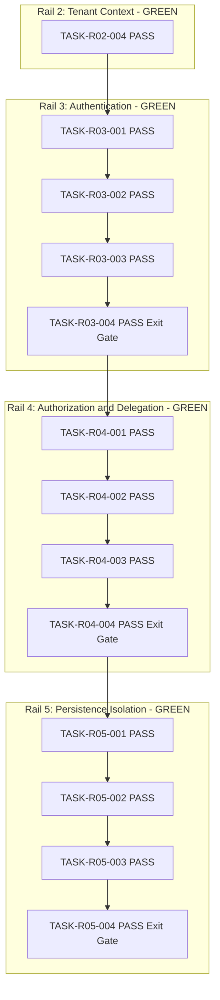
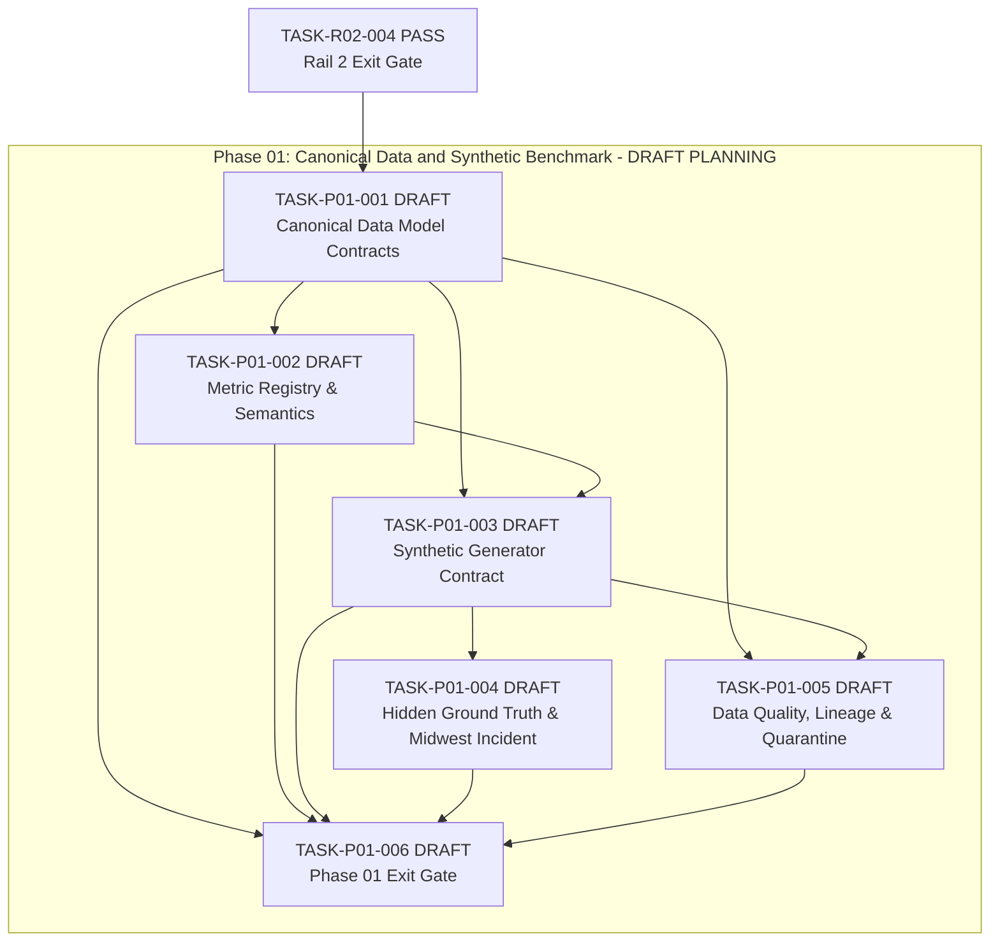
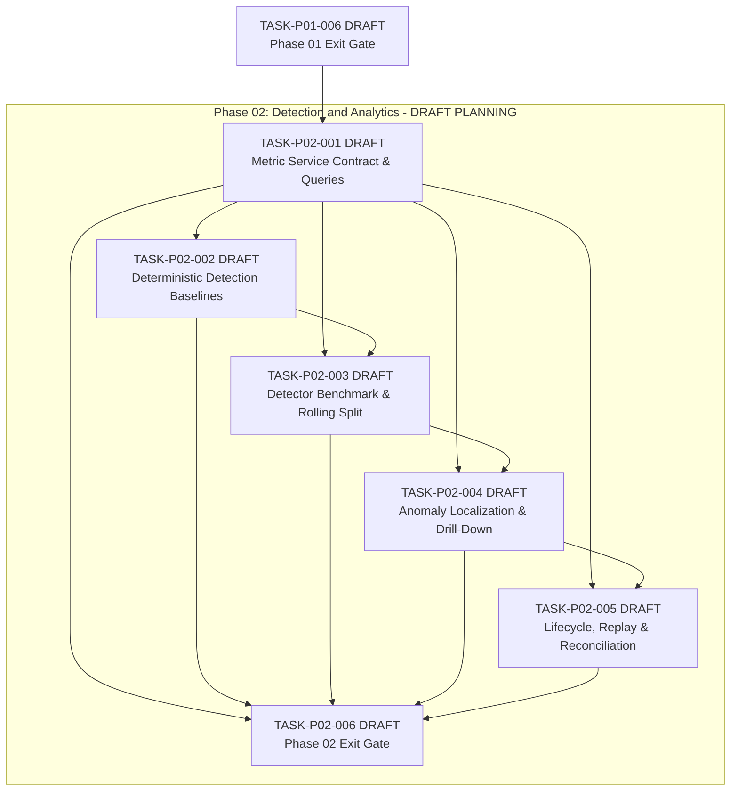
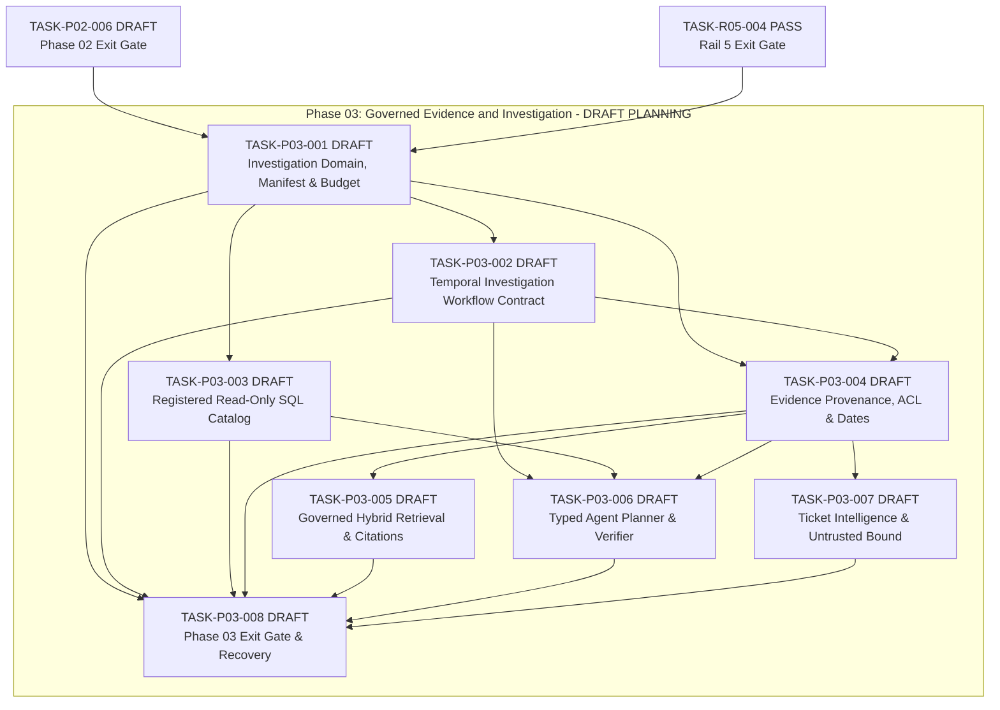
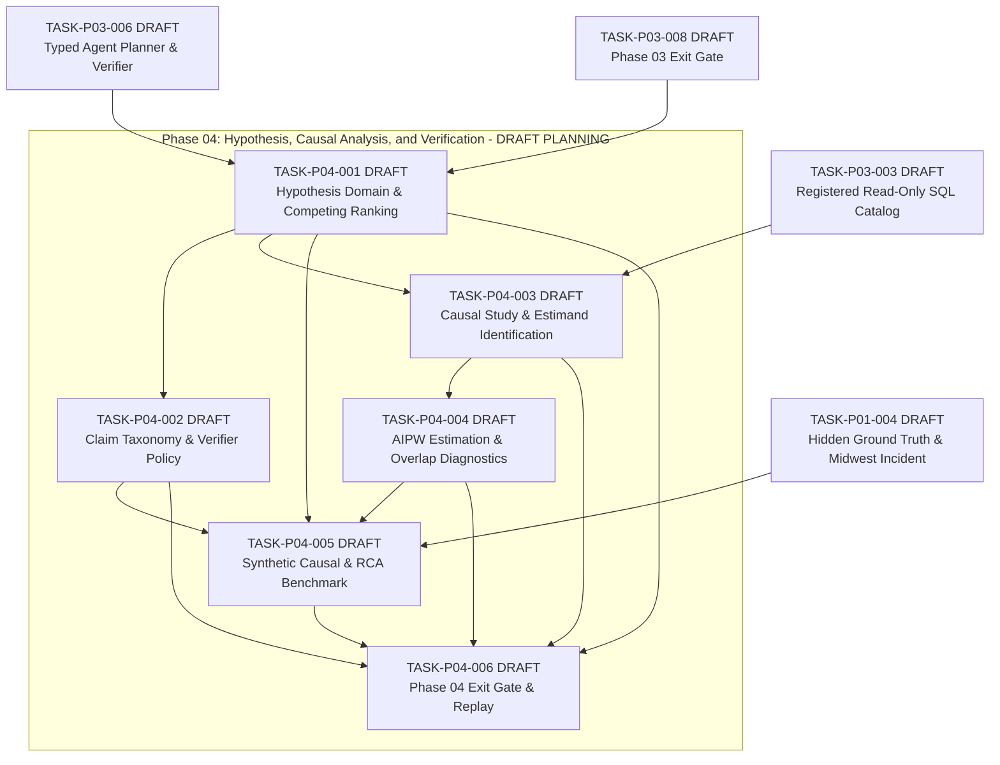
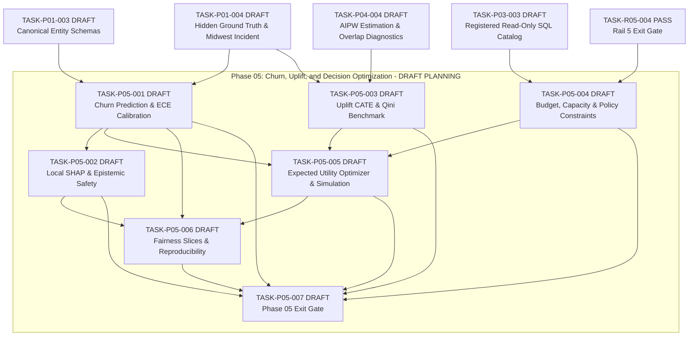
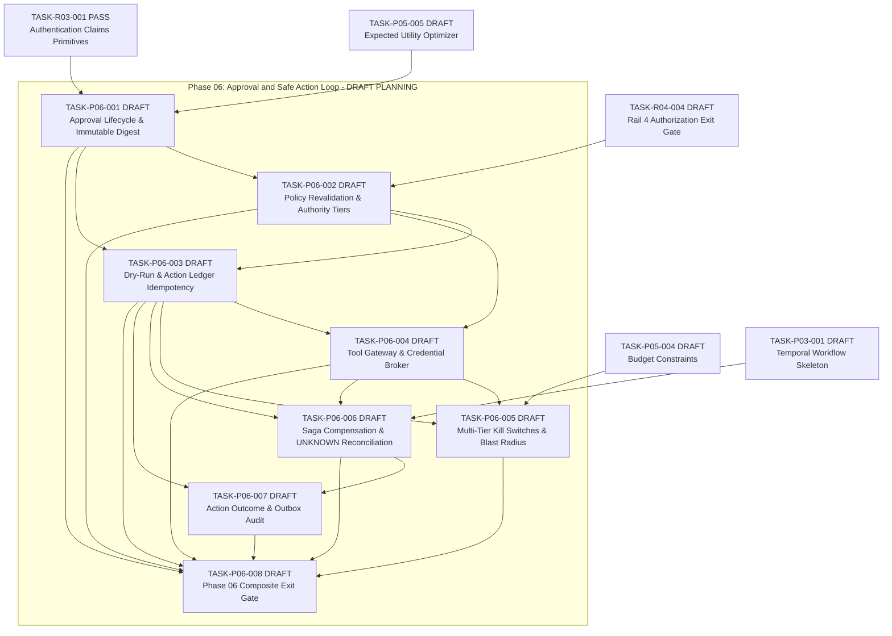
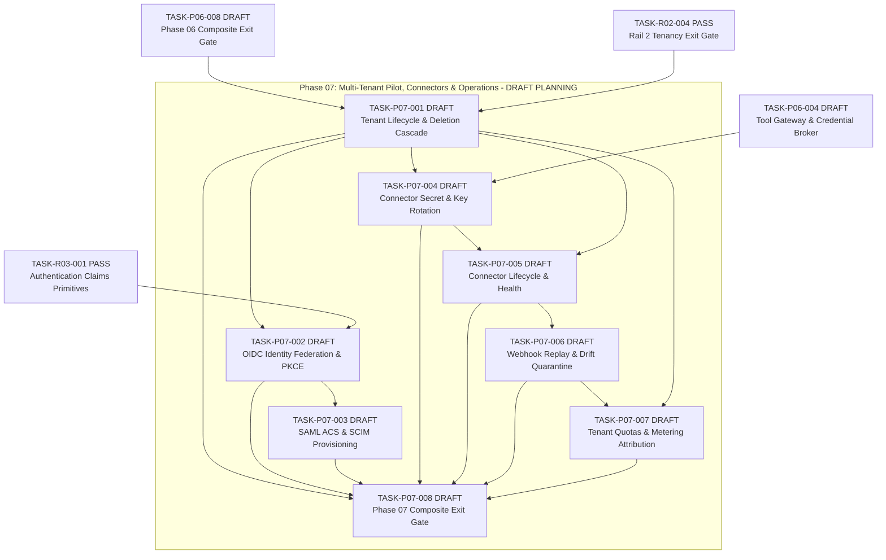
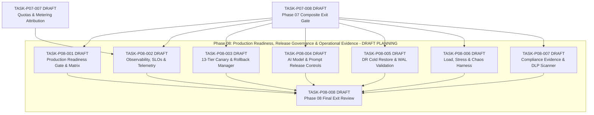
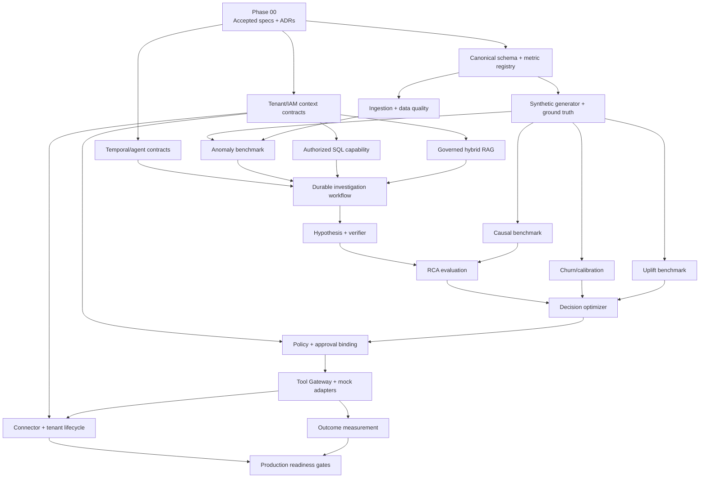

# Implementation Dependency Graph

Status: Accepted Post-Phase-08 v1.9 — Rails 0–5 GREEN; Rails 6–18 LOCKED; Phase 08 documentation closure complete (`DOCUMENTATION COMPLETE / VALIDATION PENDING / GO-LIVE BLOCKED`).

This file describes phase/feature dependencies. It is not an executor queue. The normative rail gates are in `execution/MICRO-TASK-RAIL-SYSTEM.md`; machine-readable planning edges are in `execution/task-graph.json`. Only one-file MICRO-TASKS explicitly listed in `execution/EXECUTOR-QUEUE.md` may be executed.

Completed Rail 1: `TASK-R01-001` through `TASK-R01-004` (all PASS). Completed Rail 2: `TASK-R02-001` through `TASK-R02-004` (all PASS). Completed Rail 3: `TASK-R03-001` through `TASK-R03-004` (all PASS). Completed Rail 4: `TASK-R04-001` through `TASK-R04-004` (all PASS). Completed Rail 5: `TASK-R05-001` through `TASK-R05-004` (all PASS). Rails 0–5 are GREEN. Rails 6–18 are LOCKED. No admitted execution node (executor queue empty).

## Control Plane Rails 3–5 Sequential Rail Dependency Chain

## Phase 01 Canonical Data and Synthetic Benchmark Micro-Task Chain

## Phase 02 Detection and Analytics Micro-Task Chain

## Phase 03 Governed Evidence and Investigation Micro-Task Chain

## Phase 04 Hypothesis, Causal Analysis, and Verification Micro-Task Chain

## Phase 05 Churn, Uplift, and Decision Optimization Micro-Task Chain

## Phase 06 Approval and Safe Action Loop Micro-Task Chain

## Phase 07 Multi-Tenant Pilot and Connectors Micro-Task Chain

## Phase 08 Production Readiness, Release Governance & Operational Evidence Micro-Task Chain

## Top-Level Phase Overview

## Parallelizable work

- After Phase 00: canonical schema, IAM/tenant context, and Temporal/agent contract spikes can proceed in parallel.
- After canonical schema: synthetic generator and ingestion/data quality can proceed in parallel.
- In Phase 03: authorized SQL, governed RAG, and durable workflow implementation can proceed in parallel against accepted contracts.
- In Phase 04/05: causal, churn, and uplift experiments can run in parallel, but decision integration waits for their versioned output contracts.
- Observability, threat tests, and cost attribution are cross-cutting tasks in every phase, not a final add-on.

## Hard gates

- No investigation implementation before tenant context and evidence contracts are accepted.
- No action adapter before policy, approval digest, idempotency, ledger, dry-run, and kill-switch contracts pass.
- No learned artifact reaches production without offline/regression/safety/canary release gates.
- No pilot tenant before cross-store isolation and deletion/export tests pass.
- No EPIC/FEATURE or wildcard task is sent to Antigravity; executor tasks require readiness >=18/20, or 20/20 for critical security/tenant/financial/action work.
- No dependent micro-task starts while an upstream task or rail is FAIL/BLOCKED/RED.
