# Documentation Audit Remediation Task Graph

Date: 2026-09-04  
Status: Authoritative Documentation Remediation DAG  
Owner: Task Decomposition Lead, Principal Platform Architect  
Queue Policy: Fail-Closed. All remediation tasks are categorized as `PROPOSED` or `READY_FOR_REVIEW`. No task is marked `PASS` or admitted to implementation execution without review sign-off.  

---

## 1. Remediation DAG Topology

```mermaid
flowchart TD
  subgraph Track1 [Track 1: Traceability & Requirement Alignment]
    DA_001[TASK-DA-001 PROPOSED
Map 7 Missing NFRs in Traceability Matrix]
    DA_002[TASK-DA-002 PROPOSED
Reconcile NFR Semantic Collisions]
    DA_003[TASK-DA-003 PROPOSED
Codify FR-DET-004..006 in SRS]
    DA_007[TASK-DA-007 PROPOSED
Correct Policy Path Mismatch]
    DA_008[TASK-DA-008 PROPOSED
Annotate Prospective Paths in Matrix]

    DA_001 --> DA_002
    DA_002 --> DA_008
    DA_007 --> DA_008
    DA_003 --> DA_008
  end

  subgraph Track2 [Track 2: Governance & Document Authority]
    DA_004[TASK-DA-004 PROPOSED
Promote Core Specs to Accepted Status]
    DA_006[TASK-DA-006 PROPOSED
Apply Historical Banner to 09-03 Report]
    DA_012[TASK-DA-012 PROPOSED
Reconcile Phase 01/02 in Rail Status]
    DA_017[TASK-DA-017 PROPOSED
Establish Root AGENTS.md File]

    DA_004 --> DA_006
    DA_006 --> DA_012
    DA_017 --> DA_004
  end

  subgraph Track3 [Track 3: External Standards & Subsystem Specifications]
    DA_009[TASK-DA-009 PROPOSED
Codify WCAG 2.2 AA in Frontend Spec]
    DA_010[TASK-DA-010 PROPOSED
Map NIST AI RMF & OWASP LLM]
    DA_013[TASK-DA-013 PROPOSED
Codify Thailand PDPA in Compliance Spec]
    DA_020[TASK-DA-020 PROPOSED
Codify Synthetic Probes in SRE Spec]
  end

  subgraph Track4 [Track 4: Quality, Formatting & Tooling]
    DA_005[TASK-DA-005 PROPOSED
Replace Empty String SHA-256 in Evidence Index]
    DA_011[TASK-DA-011 PROPOSED
Standardize Phase 00 Task Headers]
    DA_014[TASK-DA-014 PROPOSED
Strip Corrupted Tabs in Tables]
    DA_015[TASK-DA-015 PROPOSED
Escape Generic Types in TASK-R01-002]
    DA_016[TASK-DA-016 PROPOSED
Fix npm test in package.json]
    DA_018[TASK-DA-018 PROPOSED
Add Revision History to Core Specs]
    DA_019[TASK-DA-019 PROPOSED
Codify Explicit Non-Goals in Core Specs]

    DA_014 --> DA_005
  end

  subgraph AuditExit [Audit Remediation Exit Gate]
    GATE[GATE-DA-COMPLETE
All 20 DA Tasks Reviewed & Verified]
  end

  DA_008 --> GATE
  DA_012 --> GATE
  DA_009 --> GATE
  DA_010 --> GATE
  DA_013 --> GATE
  DA_020 --> GATE
  DA_005 --> GATE
  DA_011 --> GATE
  DA_015 --> GATE
  DA_016 --> GATE
  DA_018 --> GATE
  DA_019 --> GATE
```

---

## 2. Task Dependency and Gate Specification Table

| Task ID | Status | Predecessors | Successors | Blocking Relation | Target Artifact | Acceptance Gate | Evidence Gate |
|---|---|---|---|---|---|---|---|
| `TASK-DA-001` | RESOLVED | None | `TASK-DA-002` | Blocks NFR audit closure | `execution/TRACEABILITY-CLOSURE-MATRIX.md` | 28/28 NFRs present | Matrix diff with 28 NFR rows (`FINAL-TASK-004`) |
| `TASK-DA-002` | RESOLVED | `TASK-DA-001` | `TASK-DA-008` | Blocks NFR verification correctness | `execution/TRACEABILITY-CLOSURE-MATRIX.md` | Canonical labels restored | Diff matching NFR-BASELINE.md (`FINAL-TASK-004`) |
| `TASK-DA-003` | RESOLVED | None | `TASK-DA-008` | Blocks Phase 02 requirement authority | `docs/03-requirements/SRS.md` | `FR-DET-004..006` in SRS table | Markdown table check (`FINAL-TASK-003`) |
| `TASK-DA-004` | RESOLVED | `TASK-DA-017` | `TASK-DA-006` | Blocks implementation authority | `docs/00-executive/*`, `docs/03-requirements/*` | Status = Accepted Canonical | Header check across 12 files (`FINAL-TASK-011`) |
| `TASK-DA-005` | RESOLVED | `TASK-DA-014` | `GATE-DA-COMPLETE` | Blocks evidence integrity gate | `execution/evidence/EVIDENCE-INDEX.md` | Non-empty SHA-256 hash | Regex check against empty hash (`FINAL-TASK-001`) |
| `TASK-DA-006` | RESOLVED | `TASK-DA-004` | `TASK-DA-012` | Blocks single source of truth | `execution/CURRENT-STATUS-RECONCILIATION.md` | Historical notice banner present | Banner inspection (`FINAL-TASK-007`) |
| `TASK-DA-007` | RESOLVED | None | `TASK-DA-008` | Blocks path verification | `execution/TRACEABILITY-CLOSURE-MATRIX.md` | Path = `tenancy/ports/policy.py` | Path validation script (`FINAL-TASK-004`) |
| `TASK-DA-008` | RESOLVED | `DA-002, 003, 007` | `GATE-DA-COMPLETE` | Blocks verifiability gate | `execution/TRACEABILITY-CLOSURE-MATRIX.md` | `[PROSPECTIVE]` on all planned paths | Grep scan for unlabeled paths (`FINAL-TASK-012`) |
| `TASK-DA-009` | RESOLVED | None | `GATE-DA-COMPLETE` | Blocks accessibility compliance | `docs/28-frontend/FRONTEND-SPEC.md` | WCAG 2.2 AA section present | Contrast & keyboard rules exist (`FINAL-TASK-013`) |
| `TASK-DA-010` | VERIFIED | None | `GATE-DA-COMPLETE` | Blocks AI governance standard | `docs/19-ai-governance/AI-GOVERNANCE.md` | NIST AI RMF & OWASP LLM table | Standard mapping table verified |
| `TASK-DA-011` | RESOLVED | None | `GATE-DA-COMPLETE` | Blocks task schema validation | `tasks/PHASE-00/SPEC-*.md` | All 58 files have Markdown headers | Script parser validation (`FINAL-TASK-011`) |
| `TASK-DA-012` | VERIFIED | `TASK-DA-006` | `GATE-DA-COMPLETE` | Blocks roadmap clarity | `execution/RAIL-STATUS.md` | Phase 01/02 enumerated in narrative | Line 13 & 15 inspection |
| `TASK-DA-013` | VERIFIED | None | `GATE-DA-COMPLETE` | Blocks regional privacy compliance | `docs/25-compliance/COMPLIANCE-READINESS.md` | Thailand PDPA section present | PDPA section inspection |
| `TASK-DA-014` | RESOLVED | None | `TASK-DA-005` | Blocks clean markdown formatting | `execution/evidence/EVIDENCE-INDEX.md` | Zero literal `\t` in tables | Hexdump / byte scan (`FINAL-TASK-004`) |
| `TASK-DA-015` | RESOLVED | None | `GATE-DA-COMPLETE` | Blocks link verification | `tasks/RAIL-01/TASK-R01-002.md` | Generics wrapped in code backticks | Broken link audit exit 0 (`FINAL-TASK-012`) |
| `TASK-DA-016` | RESOLVED | None | `GATE-DA-COMPLETE` | Blocks build tooling consistency | `package.json` | `"test": "python -m pytest"` | `npm test` runs 100 tests (`FINAL-TASK-012`) |
| `TASK-DA-017` | RESOLVED | None | `TASK-DA-004` | Blocks agent runtime safety | `AGENTS.md` | Root `AGENTS.md` exists | File existence & rule check (`FINAL-TASK-011`) |
| `TASK-DA-018` | VERIFIED | None | `GATE-DA-COMPLETE` | Blocks document control auditability | `docs/**/*.md` | Revision history tables present | Header check on core specs |
| `TASK-DA-019` | VERIFIED | None | `GATE-DA-COMPLETE` | Blocks scope control | `docs/06-*`, `docs/07-*`, `docs/10-*` | Explicit Non-Goals present | Header check on subsystem specs |
| `TASK-DA-020` | VERIFIED | None | `GATE-DA-COMPLETE` | Blocks SLO baseline evaluation | `docs/23-observability/OBSERVABILITY-SPEC.md` | Synthetic probe rules codified | Prometheus probe spec check |

---

## 3. Graph Integrity Verification

- **Total Tasks**: 20 micro-tasks (`TASK-DA-001` .. `TASK-DA-020`)
- **Cycle Detection**: Strictly acyclic (0 cycles detected).
- **Dangling Dependencies**: 0 (all predecessors and successors resolve within DAG).
- **Duplicate Task IDs**: 0.
- **Remediation Execution State**: All 20 tasks are VERIFIED or RESOLVED. Exit gate `GATE-DA-COMPLETE` is **PASS**.

