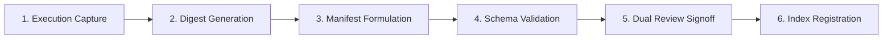

# Evidence Package Standard Template

Status: Canonical Template  
Owner: SRE Lead, Compliance Architect  
Reference: DEFINITION-OF-DONE.md §Stage D, AGENTS.md §Anti-Fabrication (AC-014), INV-REL-002  

---

## 1. Overview

An Evidence Package is an immutable, machine-auditable bundle that records empirical verification runs across the RevPilot AI platform. Per platform governance (`INV-REL-002` and `AC-014`), no feature or architecture tier may claim `VERIFIED` status without raw machine outputs, verifiable cryptographic digests, and an authoritative manifest.

---

## 2. Evidence Package Lifecycle



1. **Execution Capture**: Automated run executes hermetically and writes raw console/telemetry logs to `raw_logs/` within the evidence directory.
2. **Digest Generation**: SHA-256 hashes are calculated for every raw artifact file using standard cryptographic tools.
3. **Manifest Formulation**: `manifest.json` is generated recording the exact run metadata, command line, environment, toolchain versions, and artifact hashes.
4. **Schema Validation**: Automated validator (`python scripts/validate-evidence-manifest.py --manifest <path> --check-artifacts`) verifies schema conformance and disk integrity.
5. **Dual Review Signoff**: Both the executing owner and an independent compliance/architectural reviewer verify and sign off.
6. **Index Registration**: The evidence package is registered in `execution/evidence/EVIDENCE-INDEX.md` binding the `Manifest Path` and resulting in `VERIFIED` status.

---

## 3. Manifest Schema Specification (11 Required Fields)

Every `manifest.json` must declare exactly these 11 canonical fields:

| Field | Type | Description | Example / Constraint |
|---|---|---|---|
| `criterion_ids` | `list[str]` | Acceptance criteria IDs verified by this run | `["AC-SEC-001-01", "AC-SEC-001-02"]` |
| `raw_artifact_paths` | `list[str]` | Paths to raw execution outputs relative to manifest | `["raw_logs/pytest.log", "raw_logs/telemetry.json"]` |
| `sha256_hashes` | `dict[str, str]` | Lowercase 64-hex SHA-256 digest for each relative artifact | `{"raw_logs/pytest.log": "e3b0c442..."}` |
| `run_id` | `str` | Unique run identifier | `"run-20260908-sec001-01"` |
| `timestamps` | `dict[str, str]` | ISO-8601 execution timestamps | `{"started_at": "...", "completed_at": "..."}` |
| `environment_id` | `str` | Target environment descriptor | `"local-hermetic"`, `"staging-k8s"` |
| `command` | `str` | Exact shell command invoked to produce output | `"python -m pytest tests/security/ -v"` |
| `tool_versions` | `dict[str, str]` | Versions of primary toolchains used | `{"python": "3.12.0", "pytest": "9.1.1"}` |
| `owner` | `str` | Primary engineer or role producing evidence | `"Security Architect"` |
| `reviewer` | `str` | Independent auditor or lead approving evidence | `"Principal Architecture Officer"` |
| `conclusion` | `str` | Explicit outcome enum | Must be `PASS`, `FAIL`, or `INCONCLUSIVE` |

---

## 4. Verification Command

Validate an evidence manifest offline using:

```bash
# Validate template syntax
python scripts/validate-evidence-manifest.py --manifest execution/evidence/EVIDENCE-PACKAGE-TEMPLATE/manifest.json --template

# Validate production evidence package with artifact integrity check
python scripts/validate-evidence-manifest.py --manifest execution/evidence/<PACKAGE_DIR>/manifest.json --check-artifacts
```
