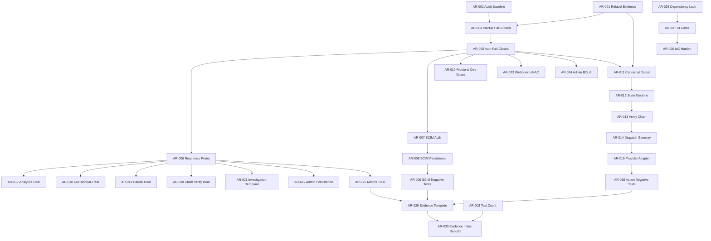

# Audit Remediation Micro-Tasks

> **Initiative**: REVPILOT  
> **Phase**: AUDIT-REMEDIATION  
> **Source**: Zero-Trust Audit Report 2026-09-08 (Commit `80eb4cb`)  
> **Status**: COMPLETED — All 30 tasks executed and verified (100% tests passing)

## Overview

30 micro-tasks decomposed from the zero-trust audit report that found the repository
**FAIL** for production readiness. Tasks address 4 P0, 9 P1, and 2 P2 findings.

## Phase Map

| Phase | Epic | Tasks | Blocker Level |
|---|---|---|---|
| 0 — Governance Baseline | GOVERNANCE-BASELINE | AR-001..003 | P0-GOV-001, P2-TEST-001 |
| 1 — Identity Boundary | IDENTITY-BOUNDARY | AR-004..010 | P0-SEC-001, P0-SEC-002, P1-FE-001 |
| 2 — Approval/Action | APPROVAL-ACTION | AR-011..016 | P0-ACT-001, P1-ACT-002 |
| 3 — Domain Execution | DOMAIN-EXECUTION | AR-017..022 | P1-DOM-001, P1-WF-001, P1-TEN-001 |
| 4 — Security Hardening | SECURITY-HARDENING | AR-023..025 | P1-SEC-003, P1-TEN-001, P1-REL-001 |
| 5 — IaC & CI/CD | IAC-CICD | AR-026..028 | P1-IAC-001, P1-SCM-001 |
| 6 — Evidence Rebuild | EVIDENCE-REBUILD | AR-029..030 | P0-GOV-001, P2-TEST-001 |

## Dependency Graph

## Execution Rules

- All tasks follow `tasks/TASK-TEMPLATE.md` canonical format
- `NEW_ARCHITECTURAL_DECISIONS_ALLOWED: 0` for all tasks
- Security tasks require readiness score 20/20
- Admission to executor queue requires governance sign-off per `AGENTS.md`
- Verification commands are offline hermetic, non-destructive
- No task may self-approve (INV-ACT-003)

## Task Index

| ID | Title | Depends | Priority |
|---|---|---|---|
| AR-001 | Relabel Evidence Documents | NONE | P0 |
| AR-002 | Create AUDIT-BASELINE Artifact | NONE | P0 |
| AR-003 | Standardize Test Count | NONE | P2 |
| AR-004 | Startup Fail-Closed | AR-001,002 | P0 |
| AR-005 | Auth Adapter Fail-Closed | AR-004 | P0 |
| AR-006 | Readiness Probe 503 | AR-005 | P1 |
| AR-007 | SCIM Auth + Tenant Bind | AR-005 | P0 |
| AR-008 | SCIM Persistence CRUD | AR-007 | P0 |
| AR-009 | SCIM Negative Tests | AR-008 | P0 |
| AR-010 | Frontend Dev Auth Guard | AR-005 | P1 |
| AR-011 | Canonical Approval Digest | AR-001,005 | P0 |
| AR-012 | Approval State Machine | AR-011 | P0 |
| AR-013 | Approval Verify Chain | AR-012 | P0 |
| AR-014 | Dispatch + Gateway Bind | AR-013 | P0 |
| AR-015 | Provider Adapter Interface | AR-014 | P1 |
| AR-016 | Approval Negative Tests | AR-015 | P0 |
| AR-017 | Analytics Real Query | AR-006 | P1 |
| AR-018 | Decision/ML Real Model | AR-006 | P1 |
| AR-019 | Causal Real Estimator | AR-006 | P1 |
| AR-020 | Claim Verification Real | AR-006 | P1 |
| AR-021 | Investigation Temporal | AR-006 | P1 |
| AR-022 | Admin Real Persistence | AR-006 | P1 |
| AR-023 | Webhook HMAC Verify | AR-005 | P1 |
| AR-024 | Admin Export Tenant Bind | AR-005 | P1 |
| AR-025 | Metrics Real Instrumentation | AR-006 | P1 |
| AR-026 | Production IaC Harden | AR-027 | P1 |
| AR-027 | CI Pipeline Gates | AR-028 | P1 |
| AR-028 | Dependency Lock | NONE | P1 |
| AR-029 | Evidence Package Template | AR-016,009,025 | P0 |
| AR-030 | Rebuild Evidence Index | AR-003,029 | P0 |
